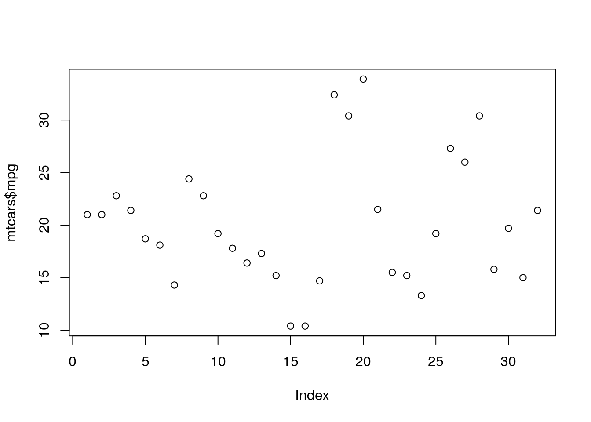

```r
pkgs <- c("plotly", "dplyr","tidyr","leaflet")
install.packages(pkgs)
```

```
Installing packages into '/usr/local/lib/R/site-library'
(as 'lib' is unspecified)
```

```
also installing the dependencies 'gridExtra', 'hexbin', 'raster', 'sp', 'viridis', 'leaflet.providers'
```
# Second week

During this module, we'll learn how to create Quarto files. We'll also explore `leaflet` and `plotly` and their usage to create interactive content.
Learning Objectives 
Create Quarto file
Employ R code in a Quarto file
Create a map using Leaflet
Use Leaflet to add legends, markers, circles, and rectangles to your map

## Quarto

Quarto is an open-source document format and toolchain designed for reproducible research and technical publishing. It aims to provide a seamless workflow for creating dynamic documents that combine code, text, and graphics, allowing users to generate reports, papers, books, and websites. It is based on the popular Pandoc tool. Quarto is a publishing system that allows you to create and publish content to Posit Connect, a publishing platform. With Quarto, you can create and publish your content to Posit Connect, a publishing platform. Quarto content supports executable code in multiple languages, and supports interactivity through a number of technologies.

Here are some key features of Quarto:

- Markdown-based: Quarto documents are written in Markdown, a lightweight markup language that is easy to read and write. Markdown allows you to add formatting, headings, lists, images, and other elements to your document.

- Embeddable code: Quarto allows you to embed code chunks within your Markdown document. These code chunks can be executed, and their output can be included in the final document. Code chunks can contain code from various programming languages such as R, Python, Julia, and more.

- Reproducibility: Quarto emphasizes reproducibility by enabling the capture of code, data, and environment dependencies. This ensures that the document can be reproduced exactly as intended, even if changes are made to the underlying code or data.

- Dynamic documents: Quarto documents are dynamic, meaning that they can be rendered in multiple output formats, such as HTML, PDF, Word, and more. You can easily switch between formats without changing the content of your document.

- Extensible: Quarto provides extensibility through a plugin system. Plugins allow you to add custom functionality and features to your documents, such as additional output formats, syntax highlighting, interactive elements, and more.

To work with Quarto, you'll need to install the Quarto command-line tool (CLI) and have a basic understanding of Markdown and the programming languages you intend to use within your documents. The [Quarto website](quarto.org) provides comprehensive documentation, tutorials, and examples to help you get started with creating dynamic and reproducible documents using Quarto. To start this exciting journey, visit the [get-started](https://quarto.org/docs/get-started/) page on the Quarto website and follow the instructions to install Quarto on your computer.

### Quarto and R Markdown

According to the website, the primary objective of Quarto is to significantly enhance the process of creating and collaborating on scientific and technical documents. Quarto brings together the capabilities of various tools like R Markdown, bookdown, distill, xaringian, and more into a cohesive and comprehensive system. It incorporates the valuable insights gained from the development and use of R Markdown over the past decade. In scientific discourse, the use of different languages and runtimes is extensive, with the Jupyter ecosystem being particularly popular. Quarto is designed to be versatile and adaptable, supporting multiple languages and engines. Currently, it supports Knitr, Jupyter, and Observable, and it has the potential to accommodate additional engines in the future.

Unlike R Markdown, which is closely tied to R, Quarto aims to extend its benefits to a wider range of users. Quarto does not have a dependency or requirement for R, making it accessible to practitioners from various backgrounds. It was developed with multilingual capabilities from the start, supporting languages such as R, Python, JavaScript, and Julia, while remaining adaptable to future languages. Although Quarto is a relatively new system, it is highly compatible with existing content. Most R Markdown documents and Jupyter notebooks can be rendered in Quarto without any modifications. The objective is to make a significant and long-term investment in reproducible research, while ensuring compatibility with existing formats and adaptability to different user environments.
In summary, it is safe to say Quarto is the next generation of R markdown for multiple languages.In the following sections we will be looking into Quarto and its features in more details. It is important to note that Quarto is still in its early stages of development and it is not yet ready for production use. However, it is being actively developed and improved, and we encourage you to try it out. Most of the features we will discuss can be used in R Markdown exactly or with slight syntax modification.

### Quarto 1.1

What makes Quarto/ R Markdown particularly useful is that these embed code, results, and plots from the analysis into the document, making it a self-contained and reproducible unit. In contrast, traditional workflows typically involve separate documents and code files, with manual copying and pasting or saving and importing files, which can create issues with version control and reproducibility. Quarto provides a consistent structure for generating presentations and documents, making it a better option for those concerned with reproducibility. For instance, in a corporate setting where a report needs to be presented routinely, having a script that generates the presentation with the latest data in a version-controlled way would be more efficient and reliable than manually copying and pasting each time. Quarto can be useful for creating recurring or automated presentations, but it has many other uses as well. One important benefit of Quarto is its ability to improve the reproducibility of documents. In the academic community, there have been many instances where papers have been published and subsequent groups have tried to reproduce the results, only to find that it's often not possible. This can lead to disputes and uncertainty over who is right. However, embedding the code in a document using Quarto greatly improves its reproducibility. While there may still be some external factors that impact the results, overall it goes a long way towards creating more reliable and reproducible documents. This class emphasizes the creation of products, and your presentation serves as your product pitch. Therefore, we want your pitch to be in one of the reproducible formats. Given these, let's move on to some examples.

### Quarto 1.2

We encourage you to download [Download hello.qmd](https://quarto.org/docs/get-started/hello/rstudio/_hello.qmd) and familiarize yourself with the Quarto environment.
Quarto offers multiple options for creating output formats, including HTML, PDF, Word, and more. It also provides you with variety of formats for creating presentations such as [revealjs](https://quarto.org/docs/presentations/revealjs/), [Powerpoint](https://quarto.org/docs/presentations/powerpoint.html) and [Beamer](https://quarto.org/docs/presentations/beamer.html). In this class, we'll focus on HTML, and Revealjs. Revealjs stands out as the most feature-rich format and is highly recommended for creating presentations. However, you are encouraged to explore the other options [here](https://quarto.org/docs/output-formats/html-basics.html).

Now, we will create a new html. To do so, we need to go to File > New File > Quarto Document... As we mentioned earlier Quarto is a work in progress, we noticed sometimes you might not see Quarto Document... under New File, in that case you could create an empty R script save it and before working on it change the name extension to .qmd then open the file and start working on it. Once you have your Quarto document opened, you should make sure you have the yml section, which looks like:


```r
---
title: "My first Quarto document"
author: "Brian Caffo"
format: html
editor: visual
---
```

Let's take a look at the preamble section surrounded by three dashes. It is extremely important to start your YAML part with `---` and end it with `---`. The title is the title of your document, and the format is the output format. However, if you prefer a PDF output, it requires the installation of MiKTeX on Windows, MacTeX on OS X, or TeX Live on Linux. These installations are easy to set up but can be quite large. The editor is the editor you want to use. You can use the visual editor, which is the default, or you can use the code editor. The code editor is a bit more advanced, which means you will be dealing with text entirely. The visual editor is a bit more limited, but it is easier to use. Once the YAML file is set up, let's compile it to see what it looks like. To compile the document you should click on the Render button. And there you go, it's running and the output is "My first Quarto document" and the line below that shows the author name. Your homework is to create a new presentation using the template, compile it once, and then we'll move on to adding content.

### Quarto 1.3

In body part you see two main sections these two the text section and code chunks. The code chunks are like a window to R and you will generate the results of your analysis and graphs using the code chunks. You can start a code chunk using using the following structure:


```r
---
title: "Title of your document"
author: "The author"
format: html
editor: visual
---
```

```r
# your code
```
````

If you just make a Quarto file with the provided template and render it you will see there are two files created in the same directory as your Quarto file. The first one is the HTML file, the second one is a folder with `_files` in its name. The HTML file is the output of your Quarto file. The folder is where all the images and plots will be saved and it is necessary to open the html file properly. However; we usually are interested in one single file that is self contained. To address this issue we need to edit the YAML part to look like the following:

```
---
title: "Title of your document"
author: "The author"
format:
    html:
        self-contained: true
editor: visual
---
```

It is important to note that the YAML part is very sensitive to indentation and you should be careful about it. Now if you render your Quarto file you will see there is only one HTML file created. This is the file you can share with others and it is self contained.

Now let's take a look at creating presentations in Quarto. In order to make presentations you need to swap the format from html to revealjs. The YAML part should look like the following:

```
---
title: "Title of your document"
author: "The author"
format:
    revealjs:
        self-contained: true
editor: visual
---
```

To create a new slide with title, add two pound signs `##` and then the slide title, such as "My New Slide" and for slides without title use `***`.

```
---
title: "Title of your document"
author: "The author"
format:
    revealjs:
        self-contained: true
editor: visual
---

## My New Slide
This is part of the content for "My New Slide".

***
This slide has no title!

```

Now if you render the code you will see a slide with some content and a slide without a title. As you can see, we used two pound signs to create a slide with a title, and three asterisks to create a slide without a title. Now, let's add a few features to our presentation. We encourage you render your file after adding each of the features to understand what is happening.

- To add pause to the presentation we'll use `. . .`
- To add a list with a few bullet points use `- bullet point' on single line.
- By default, number and bullet lists within slides are shown in their entirety. However, you have the option to explicitly control whether a list appears incrementally or all at once. To achieve this, you can enclose the list within a div element and assign it a specific class that defines the desired mode.


```r
::: {.incremental}
- Item 1
- Item 2
:::
```

- If you wish to have a numbered list you can use the following structure:


```r
::: {list}
1. Numbered list item 1
2. Numbered list item 2
:::
```

- Sometimes you have a long list of bullet points and you want to keep those in one slide. To add legibility to your slide you can make the slide scrollable by adding scrollable class the slide. `## Slide Title {.scrollable}`

The following code summarizes all the mentioned points and you can use it as a template for your presentations.

```
---
title: "Title of your document"
author: "The author"
format:
    revealjs:
        self-contained: true
editor: visual
---

## My New Slide
This is part of the content for "My New Slide".

***
This slide has no title!

## My second slide

This is part of the content for "My second slide".

. . .

This part will show up after a click because of the implemented **pause**.


## My third slide

Here are some bullet points:

- Bullet 1
- Bullet 2
- Bullet 3

We also show a numbered list:

::: {list}
1. Numbered list item 1
2. Numbered list item 2
:::

As you can see, the bullet points are not animated.

## My fourth slide

Here are some animated bullet points:

::: {.incremental}
- Bullet 1
  - sub bullet 1
  - sub bullet 2
- Bullet 2
- Bullet 3
:::


## Scrollable slide {.scrollable}

- Bullet 1
  - sub bullet 1
  - sub bullet 2
- Bullet 2
- Bullet 3
- Bullet 4
- Bullet 5
- Bullet 6
- Bullet 7
- Bullet 8
- Bullet 9
- Bullet 10
```

Now, it's time to create some slides with your own content. Add titles, bulleted and ordered lists to your slides.

### Quarto 1.4

Let's take a look at some formatting options. For instance, if we write plain text, `*italicized text*`, and `**bold text**`, you can see that it's automatically syntax highlighted. Additionally, we can add some code, such as `1:10`, by using single right-facing quotation marks. Remember that to use italics, you need to have one asterisk next to the leading character, and to use bold, you need two asterisks next to the leading character. It's important to note that the asterisks must be next to the leading character for it to work correctly. In order to add breaks between the lines we use `<br><br>` because using the `Enter` key will not have effect on the output. One simple option that can add to readability of your document is adding table of content to the document especially when using html output. You can achieve this by editing the YAML part and adding `toc: true` right below the `self-contained: true`.
If you are interested in having different themes than the default you have options! You can find the list of available themes [here](https://quarto.org/docs/presentations/revealjs/#themes). To change the theme you need to edit the YAML part and add `theme: name of the theme` right under `revealjs:` section.

To check these effects you can copy and run the following example and see the results.


```r
---
title: "Title of your document"
author: "The author"
format:
    revealjs:
        self-contained: true
        theme: dark
        toc: true
editor: visual
---

## My New Slide
This is part of the content for "My New Slide". <br><br>

**bold text**


*italicized text*
```

As the last part in this section, we will cover ways to add images to your presentation. To add an image to your presentation you can either use the local image files or online images. With local image approach, you need to have the image file in the same directory as your Quarto file. Then you can use the following structure to add the image to your presentation.


```r

```

To specify the image size we will add `{width=300}` right after the image file name. The number 300 is the width of the image in pixels. You can change it to any number you wish. To incorporate online images you can add the image URL instead of the image file name. The rest of the structure is the same as the local image approach. Let's take a look at an example.


```r
{width=300}
```

### Quarto 1.5

Let's add some code to our document. To do so, we will use the structure that we showed you before. For example let's say you are intrested in displaying the `mtcars` dataset in a slide.


```r
---
title: "Title of your document"
author: "The author"
format:
    revealjs:
        self-contained: true
editor: visual
---

## This slide contains R code
```

```r
head(mtcars)
```

```
                   mpg cyl disp  hp drat    wt  qsec vs am gear carb
Mazda RX4         21.0   6  160 110 3.90 2.620 16.46  0  1    4    4
Mazda RX4 Wag     21.0   6  160 110 3.90 2.875 17.02  0  1    4    4
Datsun 710        22.8   4  108  93 3.85 2.320 18.61  1  1    4    1
Hornet 4 Drive    21.4   6  258 110 3.08 3.215 19.44  1  0    3    1
Hornet Sportabout 18.7   8  360 175 3.15 3.440 17.02  0  0    3    2
Valiant           18.1   6  225 105 2.76 3.460 20.22  1  0    3    1
```
````

Now, let's play around with some options. By default, the `echo` option was set to false, which means that it didn't show the code that generated the output. If you wish to include the code in a slide you should set `echo` to `true` and regenerate the presentation, you'll see it shows both the output and the code that generated it.


```r
---
title: "Title of your document"
author: "The author"
format:
    revealjs:
        self-contained: true
editor: visual
---

## This slide contains R code that will be displaye with the results!
```

```r
#| echo: true

head(mtcars)
```

```
                   mpg cyl disp  hp drat    wt  qsec vs am gear carb
Mazda RX4         21.0   6  160 110 3.90 2.620 16.46  0  1    4    4
Mazda RX4 Wag     21.0   6  160 110 3.90 2.875 17.02  0  1    4    4
Datsun 710        22.8   4  108  93 3.85 2.320 18.61  1  1    4    1
Hornet 4 Drive    21.4   6  258 110 3.08 3.215 19.44  1  0    3    1
Hornet Sportabout 18.7   8  360 175 3.15 3.440 17.02  0  0    3    2
Valiant           18.1   6  225 105 2.76 3.460 20.22  1  0    3    1
```

```r
plot(mtcars$mpg)
```


````

On the other hand, if we want to show the code but not evaluate it, we can set `eval` to `false`.


```r
---
title: "Title of your document"
author: "The author"
format:
    revealjs:
        self-contained: true
editor: visual
---

## This slide contains R code that won't be executed!
```

```r
#| echo: true
#| eval: false

head(mtcars)
```

```
                   mpg cyl disp  hp drat    wt  qsec vs am gear carb
Mazda RX4         21.0   6  160 110 3.90 2.620 16.46  0  1    4    4
Mazda RX4 Wag     21.0   6  160 110 3.90 2.875 17.02  0  1    4    4
Datsun 710        22.8   4  108  93 3.85 2.320 18.61  1  1    4    1
Hornet 4 Drive    21.4   6  258 110 3.08 3.215 19.44  1  0    3    1
Hornet Sportabout 18.7   8  360 175 3.15 3.440 17.02  0  0    3    2
Valiant           18.1   6  225 105 2.76 3.460 20.22  1  0    3    1
```

```r
plot(mtcars$mpg)
```


````

Now, it's your turn to try it out. Create a slide with some R code and experiment with different options to see how they affect the output. In the next section, we'll cover how to include figures in our presentations.

### A few Ways to Share Quarto Products

If you are dealing with a small group who have access to R you can simply share the R code and the Quarto file or just the Quarto rendered as HTML file and simply email it to a colleague. If they don't have access to R, or you don't wat to share your code you can share the HTML file. Furthermore, if you wish to share the HTML file with a wider audience, you can host it on a website. There are several options for doing this. Quarto provides numerous options for publishing documents, presentations, and websites created with it. As Quarto renders content in standard formats such as HTML, PDFs, MS Word, and more, you can publish your work virtually anywhere.

Moreover, Quarto offers a convenient "quarto publish" command that enables straightforward publishing to popular services like GitHub, Netlify, Posit Connect, and others. Additionally, there are various tools available to simplify publishing from a Continuous Integration (CI) system.
According to [Quarto websit](https://quarto.org/docs/publishing/) the following are the most common ways to publish Quarto documents:

- [Quarto Pub](https://quarto.org/docs/publishing/quarto-pub.html)
- [GitHub Pages](https://quarto.org/docs/publishing/github-pages.html)
- [Posit Connect](https://quarto.org/docs/publishing/rstudio-connect.html)
- [Netlify](https://quarto.org/docs/publishing/netlify.html)
- [Confluence](https://quarto.org/docs/publishing/confluence.html)

[Quarto Pub](https://quarto.org/docs/publishing/quarto-pub.html) is the recommended method for beginners

To publish your slides on GitHub, you can create a repository and push your Quarto and HTML files to it. When you click on the Quarto file in GitHub, it does a lot of the formatting for you. You can see what the bullets and various points are going to look like. When you click on the HTML file, it shows you the raw HTML, not the rendered presentation. Okay, let's discuss how to render the HTML file. There are different ways to do it, such as using a Chrome or Firefox add-on, but you can also publish your slides through GitHub Pages. If you encounter any issues, read up on [GitHub Pages](https://quarto.org/docs/publishing/github-pages.html).

That's all the information about Quarto we need for this class. We'll see you in the next lesson.

## Plotly

### Plotly 1.1

In this lecture, we will be discussing Plotly - a handy web application and R library. Plotly is a great tool for creating interactive web graphics in R, and it has the added benefit of integrating with multiple languages including MATLAB, Python, and JavaScript. Essentially, Plotly is a web application that enables the creation and sharing of visualizations. In addition to its integration with different languages, Plotly offers a web interface for users who prefer to upload csv files and create plots with point-and-click interactions. Plotly is particularly easy to use with R and RStudio. To install Plotly, users can simply type `install.packages("plotly")` in Rstudio consol. To use it, load it with `library(plotly)`. Plotly plots can be shared through its web interface, which offers free and paid options for private displays and user authentication. Alternatively, users can create HTML graphics that can be shared on their own websites with the Plotly R package. The Plotly web interface offers tools for interactively changing axis labels, a feature that is not available in R. In this lecture, code demonstrations will be used to showcase different types of Plotly plots. It is worth noting that Plotly graphics can be embedded in Quarto documents.

### Plotly 1.2

In this section we will walk you through a Quarto document associated with the Plotly lecture. We will be using the `library(plotly)` function, assuming that you have already installed it. The `plot_ly()` command is straightforward: `plot_ly(mtcars, x = "weight", y = "miles per gallon", mode = "markers")`. The `mtcars` dataset is stored as a dataframe and serves as the data source for this command. The x-axis represents weight, while the y-axis represents miles per gallon, and the mode is set to markers, creating a scatter plot. This code can be replicated for any dataframe to generate a scatter plot. The resulting scatter plot is interactive and can be viewed in the RStudio viewer pane. As you move your cursor over the points, their corresponding x and y values are displayed. In addition, there are various controls at the top of the viewer pane that enable you to download the plot as a PNG, adjust the scale, reset the axes, and modify the hover-over behavior, among other things. The Publish button allows you to publish the plot to RPubs with a single click, generating a web graphic. However, we'll demonstrate other methods for publishing the plot shortly. Another easy way to publish the plot is to click on Export and choose to Save as Web Page. This creates a Web page with the plot and a file with the specified name, which can be referenced and embedded into other projects. Plotly is incredibly user-friendly and straightforward. Your first assignment is to create a simple scatter plot with a different dataset, save it as a webpage, and create graphics in PNG and PDF formats. You can also try publishing the plot to RPubs.

Here is an example of the Quarto document we describe above.


```r
---
title: "How Plotly Works"
author: "Your name!"
format:
    revealjs:
        self-contained: true
editor: visual
---

## This slide contains R code!
```

```r
#| echo: true
#| eval: true

library(plotly)
```

```
Loading required package: ggplot2
```

```

Attaching package: 'plotly'
```

```
The following object is masked from 'package:ggplot2':

    last_plot
```

```
The following object is masked from 'package:stats':

    filter
```

```
The following object is masked from 'package:graphics':

    layout
```

```r
plot_ly(mtcars, x = mtcars$wt, y = mtcars$mpg, mode = "markers")
```

```
No trace type specified:
  Based on info supplied, a 'scatter' trace seems appropriate.
  Read more about this trace type -> https://plot.ly/r/reference/#scatter
```

```
Warning: `arrange_()` was deprecated in dplyr 0.7.0.

Warning: Please use `arrange()` instead.

Warning: See vignette('programming') for more help
```

```{=html}
<div id="htmlwidget-800e43e1d4e2b37c9c36" style="width:672px;height:480px;" class="plotly html-widget"></div>
<script type="application/json" data-for="htmlwidget-800e43e1d4e2b37c9c36">{"x":{"visdat":{"fc6618aefa":["function () ","plotlyVisDat"]},"cur_data":"fc6618aefa","attrs":{"fc6618aefa":{"x":[2.62,2.875,2.32,3.215,3.44,3.46,3.57,3.19,3.15,3.44,3.44,4.07,3.73,3.78,5.25,5.424,5.345,2.2,1.615,1.835,2.465,3.52,3.435,3.84,3.845,1.935,2.14,1.513,3.17,2.77,3.57,2.78],"y":[21,21,22.8,21.4,18.7,18.1,14.3,24.4,22.8,19.2,17.8,16.4,17.3,15.2,10.4,10.4,14.7,32.4,30.4,33.9,21.5,15.5,15.2,13.3,19.2,27.3,26,30.4,15.8,19.7,15,21.4],"mode":"markers","alpha_stroke":1,"sizes":[10,100],"spans":[1,20]}},"layout":{"margin":{"b":40,"l":60,"t":25,"r":10},"xaxis":{"domain":[0,1],"automargin":true,"title":[]},"yaxis":{"domain":[0,1],"automargin":true,"title":[]},"hovermode":"closest","showlegend":false},"source":"A","config":{"showSendToCloud":false},"data":[{"x":[2.62,2.875,2.32,3.215,3.44,3.46,3.57,3.19,3.15,3.44,3.44,4.07,3.73,3.78,5.25,5.424,5.345,2.2,1.615,1.835,2.465,3.52,3.435,3.84,3.845,1.935,2.14,1.513,3.17,2.77,3.57,2.78],"y":[21,21,22.8,21.4,18.7,18.1,14.3,24.4,22.8,19.2,17.8,16.4,17.3,15.2,10.4,10.4,14.7,32.4,30.4,33.9,21.5,15.5,15.2,13.3,19.2,27.3,26,30.4,15.8,19.7,15,21.4],"mode":"markers","type":"scatter","marker":{"color":"rgba(31,119,180,1)","line":{"color":"rgba(31,119,180,1)"}},"error_y":{"color":"rgba(31,119,180,1)"},"error_x":{"color":"rgba(31,119,180,1)"},"line":{"color":"rgba(31,119,180,1)"},"xaxis":"x","yaxis":"y","frame":null}],"highlight":{"on":"plotly_click","persistent":false,"dynamic":false,"selectize":false,"opacityDim":0.2,"selected":{"opacity":1},"debounce":0},"shinyEvents":["plotly_hover","plotly_click","plotly_selected","plotly_relayout","plotly_brushed","plotly_brushing","plotly_clickannotation","plotly_doubleclick","plotly_deselect","plotly_afterplot","plotly_sunburstclick"],"base_url":"https://plot.ly"},"evals":[],"jsHooks":[]}</script>
```
````

### Plotly 1.3

Let's explore some options for scatter plotting in plot_ly, as scatter plots are a common type of visualization. One option is to change the color of the points. For example, we can use the `cyl` variable from the mtcars dataset as a factor variable for coloring the points. To do this, we convert the `cyl` variable to a factor using the function as: `factor(cyl)`. Then, we plot the scatter plot using `plot_ly(mtcars, x = mtcars$weight, y = mtcars$mpg, color = as.factor(cyl), mode = "markers")`. This will create a scatter plot where the points are colored based on the number of cylinders in the car, which is effectively a categorical variable. By default, the legend will display the three values of cyl: 4, 6, and 8. Another option is to use a continuous variable for coloring the points. For example, we can use the `disp` variable from the mtcars dataset, which is a continuous variable. To do this, we plot the scatter plot using `plot_ly(mtcars, x = mtcars$weight, y = mtcars$mpg, color = disp, mode = "markers")`. plot_ly will recognize that `disp` is a continuous variable and use a continuous color gradient to display the points. The color-bar for the gradient will be displayed on the side of the plot.

Currently, the points in the scatter plot appear small, almost invisible when outputted to an HTML file. If you wish to explore the option of changing the point size in scatter plots using plot_ly you can change the size of the points using a continuous variable, in this case, `horsepower`. Each point will have a different size based on its horsepower. Color is already being used to represent the cylinder. By changing the size of the points, we can show four dimensions in the same plot: miles per gallon, weight, cylinders, and horsepower. However, since we're limited to a 2D scatter plot, color and size are the only two dimensions we can display along with the x and y coordinates.

Here is an example of the Quarto document we describe above.


```r
---
title: "How Plotly Works"
author: "Your name!"
format:
    revealjs:
        self-contained: true
editor: visual
---

## This slide contains R code!
```

```r
#| echo: true
#| eval: true

library(plotly)
plot_ly(mtcars, x = mtcars$weight, y = mtcars$mpg, color = as.factor(mtcars$cyl), mode = "markers")
```

```
No trace type specified:
  Based on info supplied, a 'scatter' trace seems appropriate.
  Read more about this trace type -> https://plot.ly/r/reference/#scatter
```

```{=html}
<div id="htmlwidget-16b42ac014f93cc354fd" style="width:672px;height:480px;" class="plotly html-widget"></div>
<script type="application/json" data-for="htmlwidget-16b42ac014f93cc354fd">{"x":{"visdat":{"fc5a363f0":["function () ","plotlyVisDat"]},"cur_data":"fc5a363f0","attrs":{"fc5a363f0":{"x":null,"y":[21,21,22.8,21.4,18.7,18.1,14.3,24.4,22.8,19.2,17.8,16.4,17.3,15.2,10.4,10.4,14.7,32.4,30.4,33.9,21.5,15.5,15.2,13.3,19.2,27.3,26,30.4,15.8,19.7,15,21.4],"mode":"markers","color":["6","6","4","6","8","6","8","4","4","6","6","8","8","8","8","8","8","4","4","4","4","8","8","8","8","4","4","4","8","6","8","4"],"alpha_stroke":1,"sizes":[10,100],"spans":[1,20]}},"layout":{"margin":{"b":40,"l":60,"t":25,"r":10},"xaxis":{"domain":[0,1],"automargin":true,"title":[]},"yaxis":{"domain":[0,1],"automargin":true,"title":[]},"hovermode":"closest","showlegend":true},"source":"A","config":{"showSendToCloud":false},"data":[{"y":[22.8,24.4,22.8,32.4,30.4,33.9,21.5,27.3,26,30.4,21.4],"mode":"markers","type":"scatter","name":"4","marker":{"color":"rgba(102,194,165,1)","line":{"color":"rgba(102,194,165,1)"}},"textfont":{"color":"rgba(102,194,165,1)"},"error_y":{"color":"rgba(102,194,165,1)"},"error_x":{"color":"rgba(102,194,165,1)"},"line":{"color":"rgba(102,194,165,1)"},"xaxis":"x","yaxis":"y","frame":null},{"y":[21,21,21.4,18.1,19.2,17.8,19.7],"mode":"markers","type":"scatter","name":"6","marker":{"color":"rgba(252,141,98,1)","line":{"color":"rgba(252,141,98,1)"}},"textfont":{"color":"rgba(252,141,98,1)"},"error_y":{"color":"rgba(252,141,98,1)"},"error_x":{"color":"rgba(252,141,98,1)"},"line":{"color":"rgba(252,141,98,1)"},"xaxis":"x","yaxis":"y","frame":null},{"y":[18.7,14.3,16.4,17.3,15.2,10.4,10.4,14.7,15.5,15.2,13.3,19.2,15.8,15],"mode":"markers","type":"scatter","name":"8","marker":{"color":"rgba(141,160,203,1)","line":{"color":"rgba(141,160,203,1)"}},"textfont":{"color":"rgba(141,160,203,1)"},"error_y":{"color":"rgba(141,160,203,1)"},"error_x":{"color":"rgba(141,160,203,1)"},"line":{"color":"rgba(141,160,203,1)"},"xaxis":"x","yaxis":"y","frame":null}],"highlight":{"on":"plotly_click","persistent":false,"dynamic":false,"selectize":false,"opacityDim":0.2,"selected":{"opacity":1},"debounce":0},"shinyEvents":["plotly_hover","plotly_click","plotly_selected","plotly_relayout","plotly_brushed","plotly_brushing","plotly_clickannotation","plotly_doubleclick","plotly_deselect","plotly_afterplot","plotly_sunburstclick"],"base_url":"https://plot.ly"},"evals":[],"jsHooks":[]}</script>
```
##

```r
#| echo: true
#| eval: true
plot_ly(mtcars, x = mtcars$weight, y = mtcars$mpg, color = mtcars$disp, mode = "markers")
```

```
No trace type specified:
  Based on info supplied, a 'scatter' trace seems appropriate.
  Read more about this trace type -> https://plot.ly/r/reference/#scatter
```

```
Warning in min(x, na.rm = na.rm): no non-missing arguments to min; returning Inf
```

```
Warning in max(x, na.rm = na.rm): no non-missing arguments to max; returning
-Inf
```

```{=html}
<div id="htmlwidget-02b386bb8b020377ebb8" style="width:672px;height:480px;" class="plotly html-widget"></div>
<script type="application/json" data-for="htmlwidget-02b386bb8b020377ebb8">{"x":{"visdat":{"fc4441eb97":["function () ","plotlyVisDat"]},"cur_data":"fc4441eb97","attrs":{"fc4441eb97":{"x":null,"y":[21,21,22.8,21.4,18.7,18.1,14.3,24.4,22.8,19.2,17.8,16.4,17.3,15.2,10.4,10.4,14.7,32.4,30.4,33.9,21.5,15.5,15.2,13.3,19.2,27.3,26,30.4,15.8,19.7,15,21.4],"mode":"markers","color":[160,160,108,258,360,225,360,146.7,140.8,167.6,167.6,275.8,275.8,275.8,472,460,440,78.7,75.7,71.1,120.1,318,304,350,400,79,120.3,95.1,351,145,301,121],"alpha_stroke":1,"sizes":[10,100],"spans":[1,20]}},"layout":{"margin":{"b":40,"l":60,"t":25,"r":10},"xaxis":{"domain":[0,1],"automargin":true,"title":[]},"yaxis":{"domain":[0,1],"automargin":true,"title":[]},"hovermode":"closest","showlegend":false,"legend":{"yanchor":"top","y":0.5}},"source":"A","config":{"showSendToCloud":false},"data":[{"y":[21,21,22.8,21.4,18.7,18.1,14.3,24.4,22.8,19.2,17.8,16.4,17.3,15.2,10.4,10.4,14.7,32.4,30.4,33.9,21.5,15.5,15.2,13.3,19.2,27.3,26,30.4,15.8,19.7,15,21.4],"mode":"markers","type":"scatter","marker":{"colorbar":{"title":"","ticklen":2},"cmin":71.1,"cmax":472,"colorscale":[["0","rgba(68,1,84,1)"],["0.0416666666666667","rgba(70,19,97,1)"],["0.0833333333333333","rgba(72,32,111,1)"],["0.125","rgba(71,45,122,1)"],["0.166666666666667","rgba(68,58,128,1)"],["0.208333333333333","rgba(64,70,135,1)"],["0.25","rgba(60,82,138,1)"],["0.291666666666667","rgba(56,93,140,1)"],["0.333333333333333","rgba(49,104,142,1)"],["0.375","rgba(46,114,142,1)"],["0.416666666666667","rgba(42,123,142,1)"],["0.458333333333333","rgba(38,133,141,1)"],["0.5","rgba(37,144,140,1)"],["0.541666666666667","rgba(33,154,138,1)"],["0.583333333333333","rgba(39,164,133,1)"],["0.625","rgba(47,174,127,1)"],["0.666666666666667","rgba(53,183,121,1)"],["0.708333333333333","rgba(79,191,110,1)"],["0.75","rgba(98,199,98,1)"],["0.791666666666667","rgba(119,207,85,1)"],["0.833333333333333","rgba(147,214,70,1)"],["0.875","rgba(172,220,52,1)"],["0.916666666666667","rgba(199,225,42,1)"],["0.958333333333333","rgba(226,228,40,1)"],["1","rgba(253,231,37,1)"]],"showscale":false,"color":[160,160,108,258,360,225,360,146.7,140.8,167.6,167.6,275.8,275.8,275.8,472,460,440,78.7,75.7,71.1,120.1,318,304,350,400,79,120.3,95.1,351,145,301,121],"line":{"colorbar":{"title":"","ticklen":2},"cmin":71.1,"cmax":472,"colorscale":[["0","rgba(68,1,84,1)"],["0.0416666666666667","rgba(70,19,97,1)"],["0.0833333333333333","rgba(72,32,111,1)"],["0.125","rgba(71,45,122,1)"],["0.166666666666667","rgba(68,58,128,1)"],["0.208333333333333","rgba(64,70,135,1)"],["0.25","rgba(60,82,138,1)"],["0.291666666666667","rgba(56,93,140,1)"],["0.333333333333333","rgba(49,104,142,1)"],["0.375","rgba(46,114,142,1)"],["0.416666666666667","rgba(42,123,142,1)"],["0.458333333333333","rgba(38,133,141,1)"],["0.5","rgba(37,144,140,1)"],["0.541666666666667","rgba(33,154,138,1)"],["0.583333333333333","rgba(39,164,133,1)"],["0.625","rgba(47,174,127,1)"],["0.666666666666667","rgba(53,183,121,1)"],["0.708333333333333","rgba(79,191,110,1)"],["0.75","rgba(98,199,98,1)"],["0.791666666666667","rgba(119,207,85,1)"],["0.833333333333333","rgba(147,214,70,1)"],["0.875","rgba(172,220,52,1)"],["0.916666666666667","rgba(199,225,42,1)"],["0.958333333333333","rgba(226,228,40,1)"],["1","rgba(253,231,37,1)"]],"showscale":false,"color":[160,160,108,258,360,225,360,146.7,140.8,167.6,167.6,275.8,275.8,275.8,472,460,440,78.7,75.7,71.1,120.1,318,304,350,400,79,120.3,95.1,351,145,301,121]}},"xaxis":"x","yaxis":"y","frame":null},{"x":[null,null],"y":[10.4,33.9],"type":"scatter","mode":"markers","opacity":0,"hoverinfo":"none","showlegend":false,"marker":{"colorbar":{"title":"","ticklen":2,"len":0.5,"lenmode":"fraction","y":1,"yanchor":"top"},"cmin":71.1,"cmax":472,"colorscale":[["0","rgba(68,1,84,1)"],["0.0416666666666667","rgba(70,19,97,1)"],["0.0833333333333333","rgba(72,32,111,1)"],["0.125","rgba(71,45,122,1)"],["0.166666666666667","rgba(68,58,128,1)"],["0.208333333333333","rgba(64,70,135,1)"],["0.25","rgba(60,82,138,1)"],["0.291666666666667","rgba(56,93,140,1)"],["0.333333333333333","rgba(49,104,142,1)"],["0.375","rgba(46,114,142,1)"],["0.416666666666667","rgba(42,123,142,1)"],["0.458333333333333","rgba(38,133,141,1)"],["0.5","rgba(37,144,140,1)"],["0.541666666666667","rgba(33,154,138,1)"],["0.583333333333333","rgba(39,164,133,1)"],["0.625","rgba(47,174,127,1)"],["0.666666666666667","rgba(53,183,121,1)"],["0.708333333333333","rgba(79,191,110,1)"],["0.75","rgba(98,199,98,1)"],["0.791666666666667","rgba(119,207,85,1)"],["0.833333333333333","rgba(147,214,70,1)"],["0.875","rgba(172,220,52,1)"],["0.916666666666667","rgba(199,225,42,1)"],["0.958333333333333","rgba(226,228,40,1)"],["1","rgba(253,231,37,1)"]],"showscale":true,"color":[71.1,472],"line":{"color":"rgba(255,127,14,1)"}},"xaxis":"x","yaxis":"y","frame":null}],"highlight":{"on":"plotly_click","persistent":false,"dynamic":false,"selectize":false,"opacityDim":0.2,"selected":{"opacity":1},"debounce":0},"shinyEvents":["plotly_hover","plotly_click","plotly_selected","plotly_relayout","plotly_brushed","plotly_brushing","plotly_clickannotation","plotly_doubleclick","plotly_deselect","plotly_afterplot","plotly_sunburstclick"],"base_url":"https://plot.ly"},"evals":[],"jsHooks":[]}</script>
```
````


Continuous color gradient:


Let’s look into a 3D scatterplot. We will show the code and display the plot, and then we will explain what it's doing.


```r
### FALSE
library (plotly)
set.seed(2016-07-21)
temp <- rnorm(100, mean = 30, sd = 5)
pressue <- rnorm(100)
dtime <- 1:100
plot_ly(x = ~temp, y = ~pressue, z = ~dtime,
        type = "scatter3d", color = ~temp)
```

This is another way to add a dimension to a scatter plot. The plot is created using web GL, which is a web-based version of the open GL graphics library. It allows you to embed interactive 3D graphics in webpages. So when you output it as a webpage, it will be interactive just like this. We have three variables in this example: temperature, pressure, and dtime. To create the dataset, we generated 100 random normal values for temperature and pressure, and dtime is just the numbers 1 to 100. We use the same `plot_ly` command as before, specifying the x, y, and z variables and setting type to `scatter3d` and mode to "markers". To add a color gradient to the plot, we use the `color = temp` parameter, which displays a key to the gradient on the side of the plot. This creates a nice interactive 3D scatter plot. For homework, I would like you to create a variety of 2D scatter plots using different plotting attributes, such as color and point shape, to visualize other dimensions. You can also create a 3D scatter plot and output it as a web page to become familiar with working with these types of plots. You may consider publishing your scatter plots on platforms like rpubs to have a public hosting. Give it a try and explore the possibilities.

### Plotly 1.4

Let's discuss a different type of chart, the line graph. To illustrate this, let's use the `airmiles` dataset, which is a time series with values corresponding to each year. We can confirm this by typing `data("airmiles")` and then `time(airmiles)` to see the associated times.


```r
data("airmiles")
time(airmiles)
```

```
Time Series:
Start = 1937 
End = 1960 
Frequency = 1 
 [1] 1937 1938 1939 1940 1941 1942 1943 1944 1945 1946 1947 1948 1949 1950 1951
[16] 1952 1953 1954 1955 1956 1957 1958 1959 1960
```

To create the line graph using Plotly, we simply use the `plot_ly` command with the "x" argument set to the time variable and the "y" argument set to "airmiles". Since these variables are in our environment, we don't need to specify a data frame. Once we plot the data, we get a time series chart with the added feature of showing the corresponding x and y values when the mouse hovers over the plot. This type of chart is often used to display market indices, such as the S&P 500.


```r
### FALSE
data("airmiles")
plot_ly(x = ~time(airmiles), y = ~airmiles, type = "scatter", mode = "lines")
```

Now, let's create a multi-line graph using stock market data. We'll need to use the `tidyr` and `dplyr` libraries for data manipulation. The `EuStockMarkets` dataset contains market indices from Germany, Switzerland, France, and Britain. To create the plot, we first convert the dataset into a data frame using the `as.data.frame` command. Then, we use the `gather` command to convert the data into a format suitable for plotting. The resulting data frame can be used with the `plot_ly` command to create a multi-line graph. Note that the original data EuStockMarkets is not a data frame, as you can check by the output of `is.data.frame(EuStockMarkets)`. However, after converting it to a data frame and then applying the `gather` command, we have transformed the data from a short format to a long format. In the long format, there is a variable called index which corresponds to the column name of the data points in the original data. Although this format may not be as convenient for display purposes, it is necessary for plot_ly to display multiple lines, as it requires a single data frame with a factor variable that demarcates the different lines.


```r
### FALSE
library(plotly)
library(tidyr)
library(dplyr)
data("EuStockMarkets")
stocks <- as.data.frame(EuStockMarkets) %>% gather(index, price) %>%
mutate(time = rep(time(EuStockMarkets), 4))

plot_ly(stocks, x = ~time, y = ~price, color = ~index,
type = "scatter", mode = "lines")
```

Therefore, we first need to convert it into a data frame using the command `stocks <- as.data.frame(EuStockMarkets)`. We then use the `gather()` function from `tidyr` to convert the data from a short format to a long format, where each index type is now in a single column called `index`. The final step is to create the time variable using the command `stocks$time <- as.Date(rownames(stocks))`. Once the data is formatted correctly, we can create the plot using plot_ly, where x is time, y is price, and color is the index type. The resulting plot will display the different index types in different colors and allow for interactive hovering over specific points to see the index value at that time. It's worth noting that using `tidyr` and `dplyr` for data manipulation is essential and highly recommended. Give it a try using this data or some other stock market data, and see if you can create your own multi-line stock market graph to display on a webpage.

### Plotly 1.5

The following examples are straightforward, so we won't provide any code demonstrations. Instead, we will show you the resulting output. To create a histogram in plot_ly, you only need to specify the x variable and set the type to `"histogram"`. The output will show the height of the bars as you move the mouse along. Additionally, you can customize the colors, create side-by-side histograms, and perform a variety of other actions in plot_ly.


For a boxplot, you'll need to provide the plot_ly data frame (in this example, it's the iris dataset), set the y variable to petal length, specify the color as species, and set the type to `"box"`. This will generate separate boxplots for each species. When you hover over the boxplot, it'll display values such as the 25th percentile, 75th percentile, and median. The whiskers extend out to 1.5 times the distance between these two values, as per Tukey's idea, which refers back to the normal distribution and the 1.5 times the inter-quartile range. If there's an outlier, plot_ly will display a little point to indicate it.


A heat map is essentially a graphical representation of an image. To create one using plot_ly, generate a matrix with random normal values and specify z=matrix, type="heatmap". The result will be an interactive heat map with a color key on the right-hand side.


As you move your mouse around, plot_ly will display x and y values and the corresponding intensity values. We can create a similar dataset as before, but with different random normal values. Next, instead of plotting the intensity values as colors, we can plot them in a third dimension as a surface. To do this, we set the type as `"surface"` and specify the z values as the intensity values. The row and column values are assigned integers for the x and y values. The resulting plot is a 3D surface.


It's worth noting that when plotting a 3D surface, there is some smoothing involved, so it's important to understand what this smoothing is doing if you plan on using this for real.

### Plotly 1.6

Here we will create a map with some interactive hover-over effects. The code in this example is a bit long, so we won't go over every detail. First, let's create the dataset.


```r
### FALSE
library(plotly)
# Create data frame
state_pop <- data.frame(State = state.abb, Pop = as.vector(state.x77[,1]))

# Create hover text
state_pop$hover <- with(state_pop, paste(State, '<br>', "Population:", Pop))

# Make state borders white
borders <- list(color = toRGB("red"))

# Set up some mapping options
map_options <- list(
scope = 'usa',
projection = list(type = 'albers usa'),
showlakes = TRUE,
lakecolor = toRGB('white')
)
plot_ly(z = ~state_pop$Pop, text = ~state_pop$hover, locations = ~state_pop$State,
        type = 'choropleth', locationmode = 'USA-state',
        color = state_pop$Pop, colors = 'Blues', marker = list(line = borders)) %>%
layout(title = 'US Population in 1975', geo = map_options)
```

As you can imagine, there are 50 rows, each representing a state. For example, the first row is for Alabama and includes its population in millions and some hover-over text. The hover-over text includes the state abbreviation, "AL", a line break, and the population in 1975, which was 3,615,000. We can also add red borders as an option, although it's not necessary. Additionally, the map options will be a list and we will set the scope to the USA. You can experiment with different options to see what works best. To dramatically alter this map for a different region or country, you may have to improvise a bit, but many of the options are self-explanatory. The `Showlakes = TRUE` option simply means that lakes will be displayed, and in this case, the lake color was set to white to avoid blending in with the blue population color.

To break down the code we start by selecting the first couple of rows of the dataset and displaying them to get an idea of what it looks like. It contains the population of each state in millions and some hover-over text which includes the state abbreviation and population in 1975. Next, we set some map options such as showing the lakes, setting the lake color to white, and selecting the USA as the scope. Then we use the `plot_ly` command to create the `choropleth` map. We use the `state_pop` data frame, set the population column as the color variable, and use the state column for locations. We set the type to choropleth and location mode to USA-states. We use a blue color palette and specify that we want to draw markers on the borders. Finally, we pass the output of `plot_ly` to `layout`, which sets a title and includes the map options we previously set.

You can go ahead and run this code now. In our case, it was a bit complicated and the map wouldn't display in the viewer. So, we saved it as a web page and overwrote the template web page that we've been using for this example. Now, when we hover over a state, we can see its population. For example, when we can hover over Alabama and see its population of 3,615,000 in 1975.

If you want to create your own map, start by using this data frame, which has more columns than just population, and try creating different maps with various options. As you experiment with different options, you'll get a better understanding of how they work. To begin with, you can replicate the map we just created and then attempt to create another map using different variables, where the color represents something else. This can be a helpful technique to create interactive maps.

### Plotly 1.7

If you're a fan of `ggplot`, then you might like this code from the Plotly website. We are using the diamond dataset to create a ggplot of carat vs. price. What's cool is that Plotly has a function called `ggplotly` that allows you to easily convert a ggplot into an interactive HTML graphic. The top window shows the ggplot in the RStudio plotting pane, while the bottom window displays it as an HTML graphic in the RStudio viewer pane, just like it would appear in a web browser.


```r
### FALSE
library(ggplot2)
library(plotly)
set.seed (100)
d <- diamonds [sample(nrow (diamonds), 1000), ]

p <- ggplot(data = d, aes(x = carat, y = price)) +
geom_point(size = 4) +
geom_smooth(aes (colour = cut, fill = cut)) +
facet_wrap(~ cut)

gg <- ggplotly(p)
```

To directly post a Plotly graph we will use the above code. We created a ggplot example, labeled gg, which can be displayed in the viewer pane by typing gg in the R prompt. However, if we type `plotly_POST(gg)`, it will post it directly to the Plotly website. You can then use their web-based graphical user interface to edit the graph by clicking on the edit option. Plotly has many tutorials and videos to help you understand how to use it. Before using Plotly, you must set two [environment variables](https://plotly.com/r/getting-started-with-chart-studio/) `plotly username` and `plotly API` key. You can find your API key by going to the settings in Plotly and copying and pasting it from there. If you set these two environment variables in your .Rprofile, you won't be prompted for your credentials every time you start R, making the process seamless.

For more information about plotly, you can visit:

- [The Plolty Website](https://plotly.com)
- [The Plotly R API](https://plotly.com/r/)
- [The Plotly R Package on GitHub](https://github.com/plotly/plotly.R)
- [The Plotly R Cheatsheet](https://images.plot.ly/plotly-documentation/images/r_cheat_sheet.pdf)
- [“Plotly for R” book by Carson Sievert](https://plotly-r.com)

## Leaflet

### Leaflet 1.1

Creating interactive maps is crucial in developing data products. One widely used JavaScript library for this is `Leaflet`, which also has an associated R package that enables the creation of interactive maps in the R environment. Using Leaflet within RStudio is especially convenient as it opens up in the RStudio window. While there are other ways to create interactive maps, such as GoogleVis, Leaflet is popular among the R community. To get started with Leaflet, you should first install the package by running the command `install.packages("leaflet")`. Let's now look at a code example that demonstrates how to create your first Leaflet map in R. To create the map, first load the library by running `library(leaflet)`, and then execute the three commands provided.


```r
library(leaflet)
my_map <- leaflet() %>%
addTiles()

my_map
```

```{=html}
<div id="htmlwidget-71aa04620febda70f0f2" style="width:672px;height:480px;" class="leaflet html-widget"></div>
<script type="application/json" data-for="htmlwidget-71aa04620febda70f0f2">{"x":{"options":{"crs":{"crsClass":"L.CRS.EPSG3857","code":null,"proj4def":null,"projectedBounds":null,"options":{}}},"calls":[{"method":"addTiles","args":["//{s}.tile.openstreetmap.org/{z}/{x}/{y}.png",null,null,{"minZoom":0,"maxZoom":18,"tileSize":256,"subdomains":"abc","errorTileUrl":"","tms":false,"noWrap":false,"zoomOffset":0,"zoomReverse":false,"opacity":1,"zIndex":1,"detectRetina":false,"attribution":"&copy; <a href=\"http://openstreetmap.org\">OpenStreetMap<\/a> contributors, <a href=\"http://creativecommons.org/licenses/by-sa/2.0/\">CC-BY-SA<\/a>"}]}]},"evals":[],"jsHooks":[]}</script>
```

You can then zoom in as much as you like on the resulting map. The code includes piping notation which we use heavily in these lectures. The first command, `leaflet()`, generates the map, while the `addTiles()` command adds the first set of content. We will discuss how to add more useful features, such as markers, later on. For now, try generating a world map and zooming around to ensure that you have successfully installed the Leaflet library.

### Leaflet 1.2

We were able to quickly generate a JavaScript map widget without any knowledge of JavaScript using the Leaflet function, which creates a background layer. The `addTiles()` function adds mapping data from Open Street Map to the background. After adding this content, we can zoom in and explore the map. However, to add markers and direct interactivity, we need to use the `addMarkers()` function, which is very easy to use. We can specify the longitude and latitude of a location and add a label to the marker. In the example, we added a marker for Johns Hopkins hospital with the label "Jeff Leek's office". The piping notation was used, and although it can be a little strange at first, it's a cleaner and easier way to read the code. We can click on the marker to see Jeff Leek's office and zoom in to see the Bloomberg School of Public Health. Additionally, it is worth noting that the Bloomberg School of Public Health is the oldest School of Public Health in the country.


```r
library(leaflet)
my_map <- my_map %>%
addMarkers(lat=39.2980803, lng=-76.5898801, popup="Jeff Leek's Office")

my_map
```

```{=html}
<div id="htmlwidget-fb4e999455cd2ff1a498" style="width:672px;height:480px;" class="leaflet html-widget"></div>
<script type="application/json" data-for="htmlwidget-fb4e999455cd2ff1a498">{"x":{"options":{"crs":{"crsClass":"L.CRS.EPSG3857","code":null,"proj4def":null,"projectedBounds":null,"options":{}}},"calls":[{"method":"addTiles","args":["//{s}.tile.openstreetmap.org/{z}/{x}/{y}.png",null,null,{"minZoom":0,"maxZoom":18,"tileSize":256,"subdomains":"abc","errorTileUrl":"","tms":false,"noWrap":false,"zoomOffset":0,"zoomReverse":false,"opacity":1,"zIndex":1,"detectRetina":false,"attribution":"&copy; <a href=\"http://openstreetmap.org\">OpenStreetMap<\/a> contributors, <a href=\"http://creativecommons.org/licenses/by-sa/2.0/\">CC-BY-SA<\/a>"}]},{"method":"addMarkers","args":[39.2980803,-76.5898801,null,null,null,{"interactive":true,"draggable":false,"keyboard":true,"title":"","alt":"","zIndexOffset":0,"opacity":1,"riseOnHover":false,"riseOffset":250},"Jeff Leek's Office",null,null,null,null,{"interactive":false,"permanent":false,"direction":"auto","opacity":1,"offset":[0,0],"textsize":"10px","textOnly":false,"className":"","sticky":true},null]}],"limits":{"lat":[39.2980803,39.2980803],"lng":[-76.5898801,-76.5898801]}},"evals":[],"jsHooks":[]}</script>
```

To recap, we were able to generate a map without knowing any JavaScript by using the leaflet function, which creates a background for the map. The `addTiles()` function adds mapping data from OpenStreetMap to the background, and this allows us to zoom in and out and look around. However, to add specific content, like markers, we need to use additional functions. The `addMarkers()` function is used to add markers to the map at specific longitude and latitude points, and we can also give them labels. If you have a map with many markers, you can use this function to add each one with its own set of coordinates and popup text. We will cover more examples in the following sections.

A quick note on the piping notation, we will show you the equivalent code to give you an idea of how it works.


```r
my_map <- my_map %>%
    addMarkers(lat=39.2980803, Ing=-76.5898801,
                popup-"Jeff Leek's Office")

# Equivalent code
my_map = addMarkers (my_map, lat=39.2980803, Ing=-76.5898801, popup="Jeff Leek's Office")
my_map
```

We're using the pipe operator to pass `my_map` as the first argument to the `addMarkers()` function. Then, we assign the result back to `my_map`. Now, you might be wondering why we're doing all of this when we could have just kept the one-liner. Well, the reason is that piping is a powerful tool that you'll want to get used to, especially when you're doing chained operations in tools like `dplyr` or in mapping contexts like this. When you're adding lots of layers and markers, it can become tedious to keep retyping the same set of commands.

### Leaflet 1.3

To add a lot of markers, you can simply put the collection of markers in a data frame. Here's an example.


```r
set.seed(2023-05-29)
df <- data.frame(lat = runif(20, min = 39.2, max = 39.3),
                 lng = runif(20, min = -76.6, max = -76.5))
df %>%
leaflet() %>%
addTiles() %>%
addMarkers()
```

```{=html}
<div id="htmlwidget-8da29ff02f5fce5b582e" style="width:672px;height:480px;" class="leaflet html-widget"></div>
<script type="application/json" data-for="htmlwidget-8da29ff02f5fce5b582e">{"x":{"options":{"crs":{"crsClass":"L.CRS.EPSG3857","code":null,"proj4def":null,"projectedBounds":null,"options":{}}},"calls":[{"method":"addTiles","args":["//{s}.tile.openstreetmap.org/{z}/{x}/{y}.png",null,null,{"minZoom":0,"maxZoom":18,"tileSize":256,"subdomains":"abc","errorTileUrl":"","tms":false,"noWrap":false,"zoomOffset":0,"zoomReverse":false,"opacity":1,"zIndex":1,"detectRetina":false,"attribution":"&copy; <a href=\"http://openstreetmap.org\">OpenStreetMap<\/a> contributors, <a href=\"http://creativecommons.org/licenses/by-sa/2.0/\">CC-BY-SA<\/a>"}]},{"method":"addMarkers","args":[[39.2864894825732,39.2299940762576,39.2868194396142,39.2648176435614,39.2034524282208,39.2523841275834,39.2422925852239,39.2261895556236,39.2269873511745,39.2098705591867,39.2364570937119,39.2888662131969,39.2609478025231,39.2786189586855,39.2703516901005,39.2445569530828,39.255668254965,39.2099286825862,39.2243766655214,39.2852305399487],[-76.5086604919052,-76.5752892623655,-76.5100951064844,-76.5805118434131,-76.561675610696,-76.5570284914458,-76.50250618672,-76.5314240249107,-76.5992470560362,-76.5542157733813,-76.531571523333,-76.5806469523814,-76.5492657151539,-76.5573733312311,-76.5911887293216,-76.5066562622553,-76.5148533556145,-76.5364025924588,-76.59071062,-76.5482194416225],null,null,null,{"interactive":true,"draggable":false,"keyboard":true,"title":"","alt":"","zIndexOffset":0,"opacity":1,"riseOnHover":false,"riseOffset":250},null,null,null,null,null,{"interactive":false,"permanent":false,"direction":"auto","opacity":1,"offset":[0,0],"textsize":"10px","textOnly":false,"className":"","sticky":true},null]}],"limits":{"lat":[39.2034524282208,39.2888662131969],"lng":[-76.5992470560362,-76.50250618672]}},"evals":[],"jsHooks":[]}</script>
```

First, let's set the seed so that we get the same results every time we run the code. Then, we'll create a data frame with some random longitude and latitudes. The data frame has 20 rows, and the columns are named "lat" and "lng". We'll pass this data frame as an argument to leaflet to create our map, which will initially be blank. If we run the code up to this point, we'll get a blank map. Next, we'll pass the output of the leaflet argument evaluated at the data frame to the `addTiles()` function. This will add the mapping data to the map, but won't plot anything yet. Finally, we'll pass the map with the mapping data to the `addMarkers()` function to add the markers. You can run the entire code at once instead of in pieces. The resulting map will have multiple markers.
Give it a try by creating your own data frame with random longitude and latitudes and adding it to a map with markers.

### Leaflet 1.4

In this section, we will cover two topics: adding custom markers and separate popups for each marker. We want to achieve this result, where each marker displays the Hopkins logo and has a separate popup. Here is an example of what we're aiming for.


```r
library(leaflet)
hopkinsIcon <- makeIcon(
    iconUrl = "https://brand.jhu.edu/assets/uploads/sites/5/2016/01/university.logo_.small_.vertical.white_.png",
    iconWidth = 31*215/230, iconHeight = 31,
    iconAnchorX = 31*215/230/2, iconAnchorY = 16
)
hopkinsLatLong <- data.frame(
    lat = c(39.2973166, 39.3288851, 39.2906617, 39.297681,39.2824806),
    lng = c(-76.5929798, -76.6206598, -76.5469683, -76.6150537, -76.6016766))

hopkinsLatLong %>%
leaflet() %>%
addTiles() %>%
addMarkers(icon = hopkinsIcon)
```

```{=html}
<div id="htmlwidget-bf78f8e5f5bd29002128" style="width:672px;height:480px;" class="leaflet html-widget"></div>
<script type="application/json" data-for="htmlwidget-bf78f8e5f5bd29002128">{"x":{"options":{"crs":{"crsClass":"L.CRS.EPSG3857","code":null,"proj4def":null,"projectedBounds":null,"options":{}}},"calls":[{"method":"addTiles","args":["//{s}.tile.openstreetmap.org/{z}/{x}/{y}.png",null,null,{"minZoom":0,"maxZoom":18,"tileSize":256,"subdomains":"abc","errorTileUrl":"","tms":false,"noWrap":false,"zoomOffset":0,"zoomReverse":false,"opacity":1,"zIndex":1,"detectRetina":false,"attribution":"&copy; <a href=\"http://openstreetmap.org\">OpenStreetMap<\/a> contributors, <a href=\"http://creativecommons.org/licenses/by-sa/2.0/\">CC-BY-SA<\/a>"}]},{"method":"addMarkers","args":[[39.2973166,39.3288851,39.2906617,39.297681,39.2824806],[-76.5929798,-76.6206598,-76.5469683,-76.6150537,-76.6016766],{"iconUrl":{"data":"https://brand.jhu.edu/assets/uploads/sites/5/2016/01/university.logo_.small_.vertical.white_.png","index":0},"iconWidth":28.9782608695652,"iconHeight":31,"iconAnchorX":14.4891304347826,"iconAnchorY":16},null,null,{"interactive":true,"draggable":false,"keyboard":true,"title":"","alt":"","zIndexOffset":0,"opacity":1,"riseOnHover":false,"riseOffset":250},null,null,null,null,null,{"interactive":false,"permanent":false,"direction":"auto","opacity":1,"offset":[0,0],"textsize":"10px","textOnly":false,"className":"","sticky":true},null]}],"limits":{"lat":[39.2824806,39.3288851],"lng":[-76.6206598,-76.5469683]}},"evals":[],"jsHooks":[]}</script>
```

```r
hopkinsSites <- c(
    "<a href='http://www.jhsph.edu/'>East Baltimore Campus </a>",
    "<a href='https://apply.jhu.edu/visit/homewood/'>Homewood Campus </a>",
    "<a href='http://www.hopkinsmedicine.org/johns_hopkins_bayview/'>Bayview Medical Center </a>",
    "<a href='http://www.peabody.jhu.edu/'>Peabody Institution </a>",
    "<a href='http://carey.jhu.edu/'>Carey Business School </a>"
)
hopkinsLatLong %>%
leaflet() %>%
addTiles() %>%
addMarkers(icon = hopkinsIcon, popup = hopkinsSites)
```

```{=html}
<div id="htmlwidget-d3a0d2a5c4d9eca38188" style="width:672px;height:480px;" class="leaflet html-widget"></div>
<script type="application/json" data-for="htmlwidget-d3a0d2a5c4d9eca38188">{"x":{"options":{"crs":{"crsClass":"L.CRS.EPSG3857","code":null,"proj4def":null,"projectedBounds":null,"options":{}}},"calls":[{"method":"addTiles","args":["//{s}.tile.openstreetmap.org/{z}/{x}/{y}.png",null,null,{"minZoom":0,"maxZoom":18,"tileSize":256,"subdomains":"abc","errorTileUrl":"","tms":false,"noWrap":false,"zoomOffset":0,"zoomReverse":false,"opacity":1,"zIndex":1,"detectRetina":false,"attribution":"&copy; <a href=\"http://openstreetmap.org\">OpenStreetMap<\/a> contributors, <a href=\"http://creativecommons.org/licenses/by-sa/2.0/\">CC-BY-SA<\/a>"}]},{"method":"addMarkers","args":[[39.2973166,39.3288851,39.2906617,39.297681,39.2824806],[-76.5929798,-76.6206598,-76.5469683,-76.6150537,-76.6016766],{"iconUrl":{"data":"https://brand.jhu.edu/assets/uploads/sites/5/2016/01/university.logo_.small_.vertical.white_.png","index":0},"iconWidth":28.9782608695652,"iconHeight":31,"iconAnchorX":14.4891304347826,"iconAnchorY":16},null,null,{"interactive":true,"draggable":false,"keyboard":true,"title":"","alt":"","zIndexOffset":0,"opacity":1,"riseOnHover":false,"riseOffset":250},["<a href='http://www.jhsph.edu/'>East Baltimore Campus <\/a>","<a href='https://apply.jhu.edu/visit/homewood/'>Homewood Campus <\/a>","<a href='http://www.hopkinsmedicine.org/johns_hopkins_bayview/'>Bayview Medical Center <\/a>","<a href='http://www.peabody.jhu.edu/'>Peabody Institution <\/a>","<a href='http://carey.jhu.edu/'>Carey Business School <\/a>"],null,null,null,null,{"interactive":false,"permanent":false,"direction":"auto","opacity":1,"offset":[0,0],"textsize":"10px","textOnly":false,"className":"","sticky":true},null]}],"limits":{"lat":[39.2824806,39.3288851],"lng":[-76.6206598,-76.5469683]}},"evals":[],"jsHooks":[]}</script>
```

We first defined our Hopkins icon by specifying its URL, width, height, and anchor points. Then we created a series of latitude and longitude values for buildings at Hopkins. We passed these values to leaflet, which generated a map with markers using the `addTiles` and `addMarkers` functions. However, we also needed to set the icon for each marker to the Hopkins icon. Once we had the markers displaying the Hopkins logo, we wanted to add links to each marker. We created a series of sites, which were text vectors containing HTML commands that created a hyperlink for each building. These sites corresponded to the latitude and longitude values in the same order. Finally, we passed the latitude and longitude values to leaflet, `addTiles`, and `addMarkers` functions, along with the Hopkins icon. We set the popup to display the collection of hopkinsSites.

Once you run the entire code, you will have a map with Hopkins logos at each marker, and separate popups with links for each building.

### Leaflet 1.5

Sometimes you may have multiple points on a map very close to each other. Leaflet offers a great solution for situations when multiple points appear too close together to differentiate. This solution is clustering, where the points are grouped together and will break apart into individual points when the map is zoomed in. To demonstrate this feature, we can define a data frame with 500 latitude and longitude points that are close together and pass it as an argument to leaflet. Then, we can add tiles and markers with default cluster options. The clusters will show the number of points they contain. As we zoom in, the clusters break apart into individual points.

Here is an example of what we're aiming for.


```r
library(leaflet)
df <- data.frame(lat = runif(500, min = 39.25, max = 39.35),
                 lng = runif(500, min = -76.65, max = -76.55))
df %>%
leaflet() %>%
addTiles() %>%
addMarkers(clusterOptions = markerClusterOptions())
```

```{=html}
<div id="htmlwidget-8649647e9dab8298a243" style="width:672px;height:480px;" class="leaflet html-widget"></div>
<script type="application/json" data-for="htmlwidget-8649647e9dab8298a243">{"x":{"options":{"crs":{"crsClass":"L.CRS.EPSG3857","code":null,"proj4def":null,"projectedBounds":null,"options":{}}},"calls":[{"method":"addTiles","args":["//{s}.tile.openstreetmap.org/{z}/{x}/{y}.png",null,null,{"minZoom":0,"maxZoom":18,"tileSize":256,"subdomains":"abc","errorTileUrl":"","tms":false,"noWrap":false,"zoomOffset":0,"zoomReverse":false,"opacity":1,"zIndex":1,"detectRetina":false,"attribution":"&copy; <a href=\"http://openstreetmap.org\">OpenStreetMap<\/a> contributors, <a href=\"http://creativecommons.org/licenses/by-sa/2.0/\">CC-BY-SA<\/a>"}]},{"method":"addMarkers","args":[[39.2822292052442,39.2827978797024,39.3464210555656,39.2772462170571,39.2562372376444,39.3069692210294,39.2511162346462,39.2859479215695,39.3279508589068,39.3319917864865,39.3333772464423,39.3422035828698,39.2545725238742,39.2882612074725,39.2813161785714,39.3368684113491,39.25501957417,39.2808355672751,39.3337306562113,39.3140985486098,39.2591460842639,39.2604270136682,39.3018013781402,39.2935426864773,39.277642406337,39.3386808291776,39.3262263001408,39.3260907989461,39.2786466788733,39.2884590673959,39.3206783223664,39.3003939819522,39.2642615824938,39.2616008975543,39.259804792353,39.3392454937566,39.2620712731732,39.2676884798566,39.2864096688572,39.2516869371291,39.3394031378906,39.2969963734271,39.3065148160094,39.3167187324725,39.3334910369013,39.2516116583953,39.2760833253618,39.2899019937729,39.3321021537762,39.2917689810041,39.3358034703182,39.3152610641904,39.3459859084804,39.3468727616593,39.3464893458644,39.2652711984469,39.2586529108696,39.3310837683268,39.2952843057225,39.3278302818304,39.3029454184463,39.2812318566954,39.2779767046217,39.2651705868077,39.2779478741577,39.3466491085244,39.3287586700171,39.2919358301442,39.3423967864132,39.2851449642796,39.2824094607495,39.2591564039234,39.2673972113058,39.308734165621,39.3167705284432,39.2743306536926,39.2919972134754,39.311335667083,39.2636653482681,39.3250712395878,39.2832755009644,39.3102350334404,39.3172273341101,39.3278475038009,39.3008078965591,39.2832008034224,39.2648732694797,39.3201776423259,39.2962240947876,39.3459846080514,39.3114142642124,39.2903003653279,39.2574810043676,39.3038363663945,39.3138318173587,39.2797619180754,39.2626522512641,39.3270940070739,39.3058051287662,39.2806889371481,39.2669497036375,39.2948430008721,39.2963375440799,39.2951765936566,39.3206356941024,39.3077368714847,39.2787640187424,39.3072720174445,39.3435876548989,39.3312389533035,39.2743501010817,39.3367310444592,39.2535148330033,39.2790522276424,39.2633260021219,39.3436151601374,39.2737059620908,39.3080536962952,39.2976192745846,39.2909936844371,39.2955021827249,39.2801504557487,39.3318351466907,39.3096461908659,39.2733371123439,39.2517693019705,39.2501311731059,39.3103283301461,39.3318431968568,39.3053193837171,39.3350781412795,39.3366859227652,39.3165053198813,39.309968468966,39.2531250061002,39.3354425992351,39.3014781828271,39.2969009445282,39.339823746006,39.3028568253387,39.3238307118183,39.3259535852587,39.3318257395411,39.3437303564278,39.3273135387572,39.3158402738161,39.2922756374581,39.3254724388011,39.2968695607968,39.3025583126349,39.3348575521028,39.2688884299248,39.3247293454362,39.2701443771832,39.3125854100334,39.3018748083618,39.275564879179,39.265401593456,39.2795737197157,39.2776086878963,39.3458821839886,39.3462255074643,39.2851554651046,39.2539939815877,39.2723009250825,39.3014554257737,39.3365281496895,39.2984762140084,39.2759371495806,39.3464064248372,39.302733338275,39.2517532281112,39.3149079417344,39.3033037630143,39.2626249529188,39.3225661897566,39.3212383852107,39.2566255916841,39.2716960354475,39.315994679206,39.3132561462233,39.2625603252789,39.2846870425157,39.2584731651237,39.2984029022511,39.2869620401645,39.3395058893366,39.2673200513702,39.3254302905872,39.3277543412289,39.2908621664392,39.2797104862286,39.3258965559304,39.3499724944821,39.3198783688014,39.3085679325974,39.2838098092936,39.2561560031725,39.2786514455918,39.2528361316305,39.3164494115394,39.2824224811513,39.3307426533429,39.3216101106256,39.2818671720568,39.3254432207206,39.3202558132587,39.2776529215975,39.2790862129536,39.2655303830514,39.2604341770988,39.2509560585488,39.3065661842236,39.3422023419291,39.3177717797225,39.3314256877638,39.2975284259301,39.3253734808182,39.2581510241143,39.3344301580917,39.2795502600726,39.2610945186578,39.3034029676579,39.2785056678113,39.26915766967,39.3188560111215,39.2832408109447,39.263124492811,39.278091800469,39.3228789753281,39.2561987144873,39.3110822200542,39.2639018729795,39.2938305418007,39.2720596642466,39.251610052865,39.2919158689212,39.323711528373,39.312711550924,39.31300112803,39.3026570490561,39.3423082595458,39.2925711743301,39.3241336557083,39.2503546874039,39.3231587542919,39.2869595568394,39.2890607449226,39.2508112250827,39.2540348953102,39.3496755601373,39.3425371651538,39.2847426741151,39.2604795868276,39.3163592335768,39.3345764896367,39.326724679023,39.2661361868493,39.2973089152016,39.3477949835127,39.3135213929927,39.3308621145552,39.3467049586121,39.3058306209277,39.2703857219778,39.3227914447198,39.3292341463733,39.2672241539229,39.2540351699106,39.2878714431077,39.2995962145738,39.3390161099378,39.34182752911,39.3240930251312,39.3257703445386,39.3016415773658,39.3138209721306,39.3230193075724,39.3227321495302,39.2542946854141,39.3469782414613,39.2854027724126,39.2687440362293,39.2819481152343,39.2635013646446,39.3116100698942,39.3200769703602,39.2826350368559,39.2730352686718,39.3235277670436,39.2828516302863,39.259182082722,39.3212942494545,39.2721871843096,39.3245544664795,39.2851780654164,39.2590454755584,39.3180049522081,39.2714369798778,39.3262068939395,39.3439421188086,39.3173534653382,39.2547735358123,39.2818901404506,39.2539955907268,39.3378955367021,39.2765793164261,39.257845983142,39.3374544786755,39.3309099524515,39.2789261687081,39.3194725763286,39.2941913985414,39.3108003752306,39.2981116474606,39.2550509464927,39.3445321489824,39.2941738313064,39.3250044460874,39.2605040743481,39.2701631362783,39.3324099413585,39.3457660245942,39.3477782163769,39.3162756870501,39.2510567666497,39.2604271690128,39.282969321683,39.2986030733213,39.343081567972,39.3065804121783,39.3118522558594,39.3034199988469,39.3439219271298,39.2982063695323,39.3335425884463,39.3099859512178,39.3233763866359,39.291006540088,39.2665158202872,39.253227022686,39.3175624056254,39.3187227984192,39.3340228773886,39.3021063008113,39.3350941058947,39.3332054325379,39.298206419684,39.2938139811624,39.3121166662313,39.2844288013875,39.3111451974139,39.3115703340853,39.2799645791063,39.2892836574232,39.2570980182849,39.2803076364798,39.3423245986691,39.2731072763447,39.2951654613717,39.3261435062392,39.277876190003,39.3455561020179,39.3457694749581,39.2814678611467,39.3092091221828,39.2979446447454,39.2544627627125,39.269338031346,39.2906062977854,39.3000343130669,39.2585400366923,39.2527728562243,39.2777358129853,39.254700681637,39.3197868824005,39.3283918105997,39.287525510136,39.3417723545572,39.2508458686061,39.2808601396857,39.2693987395614,39.293626393564,39.3426573243225,39.3322290743934,39.3414778094739,39.2961183521897,39.2703478964279,39.277958301222,39.262290441501,39.307937983959,39.2593685225118,39.2847788997926,39.2850688567851,39.2966569448821,39.2760154335294,39.2822100057965,39.3324292749632,39.34669247563,39.2669964299304,39.3482129456475,39.25204687363,39.294718672079,39.3202181261498,39.2676752036205,39.3061948307091,39.3367931541521,39.3277149775066,39.2584723818349,39.3374729082221,39.3495798916556,39.2728710060939,39.2620406841859,39.3087621231098,39.2701936314581,39.2876311936881,39.2693564926041,39.3020942301489,39.2650238166098,39.326234216732,39.3185043032514,39.3330801288132,39.3168940347852,39.3076922512846,39.3360724939266,39.3367519617081,39.2915203520795,39.2801529679215,39.3425584657816,39.3263569179922,39.3337738513947,39.338842276833,39.3090596769936,39.2568125868449,39.2500385361258,39.3307463176083,39.2951279436704,39.3354050728492,39.2943259449909,39.2748401048593,39.3075654758373,39.2541102522751,39.2743080978049,39.2728427900467,39.3180668971501,39.322697290685,39.2965936048655,39.3161589180585,39.2884833731921,39.2837699854514,39.2991112248972,39.2719716440188,39.286131516844,39.3106402606936,39.3354753464926,39.2703744078986,39.2800241853809,39.3179412603844,39.3216373802163,39.3414073350607,39.2980031937826,39.3081723267678,39.3400320718531,39.3040728469146,39.2809173314832,39.3058587113395,39.3145472505596,39.2917524353601,39.3321439997526,39.3335644158768,39.2691697016358,39.3278670913307,39.2685745849507,39.2587276888778,39.292413018248,39.2639202895574,39.3082921579015,39.3490079326089,39.2681834481424,39.3225251746597,39.2615264631109,39.2951529509621,39.2608748004539,39.2638209706172,39.2787092133658,39.2751787191257,39.2991950110532,39.347320733103,39.2779248517239,39.2614763973048,39.3239007423632,39.3059096161043,39.2632726943586,39.2503134399652,39.341803623084,39.3433609187137,39.2947027583607,39.2758421348175,39.3027643766254,39.3175682996633],[-76.5715984590817,-76.5989737631986,-76.572628382477,-76.5861405439675,-76.6419581617229,-76.6341331154574,-76.6209906843957,-76.5734024124686,-76.5718265649164,-76.5551786612486,-76.5813829713268,-76.6438199164579,-76.6384965970647,-76.6140883169137,-76.6253837608499,-76.6371721643023,-76.6297467353288,-76.5606190990191,-76.6176559909713,-76.6260828177212,-76.615086704446,-76.6025262952084,-76.5799237856409,-76.5830492072273,-76.5814801331377,-76.6001901062438,-76.632052847743,-76.5890742140356,-76.6490874550771,-76.6172993832035,-76.6451203574194,-76.5819947353797,-76.566979021579,-76.5715291048633,-76.5593176132068,-76.5731801354559,-76.5976846807636,-76.6040069988696,-76.6247753947275,-76.6103011375759,-76.5949204510776,-76.5759355742717,-76.6174569873605,-76.574432587903,-76.6373434375972,-76.5581714656437,-76.5964523440925,-76.6112006455194,-76.5643651380669,-76.6164980259491,-76.5665754886344,-76.6006983615924,-76.6332377860323,-76.607409516722,-76.5808284927858,-76.6451074475423,-76.5680907293223,-76.6243776945397,-76.6016722129891,-76.5873602101346,-76.6243422481697,-76.64965263505,-76.6064836547477,-76.5758873855695,-76.5800088654039,-76.6213822902646,-76.634488890972,-76.616197385476,-76.576182919438,-76.5551094831899,-76.5780088960892,-76.6492623436963,-76.6134566588095,-76.5751102422597,-76.631952840439,-76.5608762213495,-76.5535529829329,-76.6238006403903,-76.574926855159,-76.6176036564866,-76.5525946830865,-76.6046887355158,-76.5853768892121,-76.6466639703373,-76.5993513435125,-76.5779525026213,-76.6450767340371,-76.6242285833228,-76.6393883372424,-76.6329810345545,-76.6482749911956,-76.6272256207885,-76.6189169125864,-76.6225961268414,-76.6002591300057,-76.578915951401,-76.5803303837078,-76.6155341458041,-76.5872839774936,-76.6370029752608,-76.5813884359086,-76.5680875984253,-76.5794728016481,-76.5926023615524,-76.6196421040688,-76.5621939630248,-76.6420323399128,-76.6287015860668,-76.6221321351593,-76.5857844942715,-76.5511807782343,-76.6196461509913,-76.5898362854263,-76.6321476134006,-76.5764088516822,-76.603706882149,-76.5871735108085,-76.5669321481604,-76.6454247068847,-76.6139485881897,-76.6259738092311,-76.5601274050772,-76.5553767140489,-76.5544305957621,-76.5794764378807,-76.5773247650825,-76.5619834447512,-76.6263051382266,-76.5649303390179,-76.5922418517293,-76.6108441445045,-76.5839590499178,-76.5623195368797,-76.5908529425273,-76.6186059672618,-76.5527679577935,-76.6034226941876,-76.589413213497,-76.6397315747105,-76.5728796660202,-76.5727163108764,-76.6152942568995,-76.6352261722321,-76.5777647925774,-76.5574857625179,-76.6331917157397,-76.5730963234091,-76.6381916628918,-76.6410242872546,-76.6060590385925,-76.640066303825,-76.5596374392277,-76.5699885766953,-76.6399895718554,-76.6362468498759,-76.5575964436633,-76.6004883927293,-76.5775181262521,-76.6133890333353,-76.6312176853186,-76.5644392852904,-76.6484577912139,-76.6398573201383,-76.5773996035568,-76.583614617167,-76.6091833517654,-76.6458737181034,-76.587853083876,-76.6038782538148,-76.5780500061344,-76.5731926970417,-76.5967624290613,-76.5777467398439,-76.5540027415147,-76.5621928406181,-76.5785885522375,-76.5504476843635,-76.5903470793972,-76.6356744270073,-76.6279866478872,-76.5828412029892,-76.640915411734,-76.6276465836912,-76.5795998620568,-76.6386741729919,-76.6272669496248,-76.5935394422151,-76.6124414186925,-76.6150819140254,-76.5935608014232,-76.5565327281831,-76.6066774449544,-76.6185439286521,-76.5512388386764,-76.6038243842777,-76.5531270106323,-76.5550337144872,-76.6134397440823,-76.635436640773,-76.5697277358733,-76.6288477558875,-76.6088407353498,-76.6479057001881,-76.6094706238713,-76.6343588057207,-76.5542944269255,-76.6438139174832,-76.5558126526186,-76.6154038084205,-76.6252822316485,-76.6014367554104,-76.5794147159904,-76.6400406247471,-76.6037760217907,-76.5675346308621,-76.6044184696395,-76.5668479571585,-76.6496497615473,-76.5800634851912,-76.625935050752,-76.6000293574994,-76.6248502844712,-76.5979811697034,-76.5666129663354,-76.5531501864549,-76.5618249884108,-76.5992692384636,-76.6383507048711,-76.5886366890743,-76.5956905107945,-76.6108474408742,-76.5958704490447,-76.6173684903653,-76.6169700282626,-76.6246083548525,-76.6401481255889,-76.6269712478155,-76.6024331491208,-76.6032290545991,-76.6210850419477,-76.5981818799162,-76.6386222381378,-76.5887725543696,-76.6264010704821,-76.556887898827,-76.5898923155153,-76.5511465331074,-76.5887963619083,-76.6415016294923,-76.5647725233808,-76.5558203910012,-76.5673996084835,-76.5826815409819,-76.6295745919691,-76.6453200367512,-76.5637851339299,-76.5946449761046,-76.5842826530803,-76.6020135585219,-76.5884700021474,-76.591662677587,-76.5695251767058,-76.6428473135224,-76.628238836769,-76.6155181699665,-76.6189713352593,-76.5782287868904,-76.5745541801211,-76.6479909099173,-76.579125074693,-76.6363906834042,-76.6009897151962,-76.6394912199583,-76.5548083839007,-76.5540407304652,-76.6337265007431,-76.5950583981117,-76.6264852724969,-76.6404796105344,-76.5721513608703,-76.5515329864109,-76.5939321497688,-76.6040563475108,-76.5685341335367,-76.613044374669,-76.638054293883,-76.6288021196611,-76.5576332286,-76.6235214536777,-76.5791822102154,-76.6157594502671,-76.5679278250085,-76.5516858071089,-76.5632145735435,-76.5856736030895,-76.5890792457154,-76.5803490807302,-76.5686542982235,-76.6404599690577,-76.5525259961607,-76.5812693028012,-76.6159052535193,-76.6473046137253,-76.6221013795119,-76.5533950653393,-76.5764822575729,-76.5701886548428,-76.5968330221949,-76.586812785035,-76.5761530000949,-76.6061443051091,-76.586171216052,-76.641811058647,-76.6136116162641,-76.5716881638859,-76.6418643343728,-76.599843715434,-76.5914761191001,-76.6183355934685,-76.5743482800666,-76.5699121954152,-76.562964439136,-76.5567384232301,-76.6478807305452,-76.5734622478019,-76.6433204990346,-76.5634766968433,-76.5639949472155,-76.6067670634948,-76.5700123935007,-76.6405957410112,-76.5832494378556,-76.5773371189134,-76.6465474544559,-76.5787438564701,-76.5977463325486,-76.5554613617482,-76.6024333341513,-76.6483500510687,-76.5789124696516,-76.6294835660141,-76.6197811690625,-76.5617220311426,-76.5731174170505,-76.5878096854314,-76.5822338121943,-76.6397761164699,-76.568504047161,-76.5705792463617,-76.6341058015591,-76.5823000644799,-76.6059308471391,-76.6479326357832,-76.6123098002048,-76.5624879987212,-76.6039955387591,-76.6317044490715,-76.6404664013768,-76.623124176776,-76.5500094259856,-76.6314253609162,-76.6458419297589,-76.6210745736025,-76.6429393885657,-76.6149553886848,-76.5775176635711,-76.5910206431523,-76.6391456113663,-76.6408959110035,-76.626311438391,-76.5847792910412,-76.6341981984442,-76.5893216059776,-76.5656718386803,-76.5639260860393,-76.5894844900817,-76.5769747656304,-76.6341189735103,-76.570202390966,-76.6116221281001,-76.6207505082712,-76.6379831055179,-76.6296743104234,-76.5988967023091,-76.569381066761,-76.6081664932426,-76.5568441307172,-76.5582952465396,-76.5579533586279,-76.5666119275847,-76.5527643957408,-76.5906521854689,-76.557157160365,-76.5955720852362,-76.6458189768484,-76.5951120791724,-76.5875446585007,-76.5572538823821,-76.5825967114652,-76.5819134762511,-76.5848159415415,-76.6168121552095,-76.5605174218537,-76.5800550028915,-76.6160756106488,-76.5537211187184,-76.5743111604126,-76.6146312418161,-76.5778126825811,-76.6277766154148,-76.6128592111403,-76.647318552318,-76.6191656417912,-76.6188349764096,-76.6326130754314,-76.6372006084537,-76.6351214980707,-76.6357673200779,-76.5722473615082,-76.6280067659449,-76.6338090171339,-76.6405951058026,-76.5516089434968,-76.5963702702196,-76.6336592068197,-76.5658974942053,-76.5650823412463,-76.6267575699836,-76.6186054357793,-76.5821835477138,-76.6110921000363,-76.5796051389305,-76.623162550875,-76.5985294249374,-76.6001901808428,-76.6311364521971,-76.5604672078276,-76.6362606478622,-76.5710500569083,-76.5597524191719,-76.6281359542627,-76.5641256906558,-76.6238146222429,-76.5961523409467,-76.5927429650445,-76.5750177853974,-76.6229173513595,-76.5914542495971,-76.5666130316909,-76.569908181997,-76.6430119632976,-76.6087473394815,-76.6419073211495,-76.608311718516,-76.5795368401799,-76.6248662278987,-76.5561032157624,-76.6489680648083,-76.5896436120849,-76.5913140354445,-76.6445885126712,-76.5899262790335,-76.599726186553,-76.6323128368007,-76.5961107708979,-76.6481480114395,-76.557479645405,-76.5521701386431,-76.6444666196127,-76.5538576344959,-76.5572116173804,-76.5736433969112,-76.5892770906677,-76.5716413200833,-76.5974299556809,-76.596152965934,-76.5885417967103,-76.5510809707688,-76.5849177104654,-76.570120574953,-76.6233320016414,-76.6255573771894,-76.5906594132306,-76.6320831303718,-76.6320516338572,-76.6171684144298,-76.6078601148212,-76.6453598726774,-76.584318201337,-76.6080945480149,-76.5898033741629,-76.6305191492662,-76.6186366347363,-76.5525955786463,-76.5562682683114,-76.5805200087605,-76.6395007332088,-76.6020213697106,-76.5755301730707,-76.6197828758042],null,null,null,{"interactive":true,"draggable":false,"keyboard":true,"title":"","alt":"","zIndexOffset":0,"opacity":1,"riseOnHover":false,"riseOffset":250},null,null,{"showCoverageOnHover":true,"zoomToBoundsOnClick":true,"spiderfyOnMaxZoom":true,"removeOutsideVisibleBounds":true,"spiderLegPolylineOptions":{"weight":1.5,"color":"#222","opacity":0.5},"freezeAtZoom":false},null,null,{"interactive":false,"permanent":false,"direction":"auto","opacity":1,"offset":[0,0],"textsize":"10px","textOnly":false,"className":"","sticky":true},null]}],"limits":{"lat":[39.2500385361258,39.3499724944821],"lng":[-76.64965263505,-76.5500094259856]}},"evals":[],"jsHooks":[]}</script>
```

Additionally, we can add circle markers instead of adding markers or clusters by using the `addCircleMarkers` function. We can create a couple of 20 markers and add circle markers to them. This will display the markers as little circles.


```r
library(leaflet)
df <- data.frame(lat = runif(20, min = 39.25, max = 39.35),
                 lng = runif(20, min = -76.65, max = -76.55))
df %>%
leaflet() %>%
addTiles() %>%
addCircleMarkers()
```

```{=html}
<div id="htmlwidget-5291ce39b790584ec1a0" style="width:672px;height:480px;" class="leaflet html-widget"></div>
<script type="application/json" data-for="htmlwidget-5291ce39b790584ec1a0">{"x":{"options":{"crs":{"crsClass":"L.CRS.EPSG3857","code":null,"proj4def":null,"projectedBounds":null,"options":{}}},"calls":[{"method":"addTiles","args":["//{s}.tile.openstreetmap.org/{z}/{x}/{y}.png",null,null,{"minZoom":0,"maxZoom":18,"tileSize":256,"subdomains":"abc","errorTileUrl":"","tms":false,"noWrap":false,"zoomOffset":0,"zoomReverse":false,"opacity":1,"zIndex":1,"detectRetina":false,"attribution":"&copy; <a href=\"http://openstreetmap.org\">OpenStreetMap<\/a> contributors, <a href=\"http://creativecommons.org/licenses/by-sa/2.0/\">CC-BY-SA<\/a>"}]},{"method":"addCircleMarkers","args":[[39.2705609871075,39.3337358138524,39.3048269762658,39.2595316591673,39.3428378957091,39.3009038261138,39.2638612271287,39.3430950803915,39.2810448837932,39.2533580458257,39.2692348407581,39.2764252565801,39.2553724446567,39.3099843133008,39.3187708169222,39.2793547861511,39.3196933467407,39.2797409699298,39.3076065280708,39.2624721065396],[-76.5719670150662,-76.6401247577276,-76.6008328359109,-76.6376370966667,-76.6336159260944,-76.6040965052554,-76.5759222716093,-76.5532217880944,-76.5595904266927,-76.5880806691712,-76.6341735831229,-76.5805921366904,-76.5609286762076,-76.5846399792936,-76.6198823487386,-76.5866940950975,-76.6470686038956,-76.6158369644079,-76.6044680960942,-76.6283020999515],10,null,null,{"interactive":true,"className":"","stroke":true,"color":"#03F","weight":5,"opacity":0.5,"fill":true,"fillColor":"#03F","fillOpacity":0.2},null,null,null,null,null,{"interactive":false,"permanent":false,"direction":"auto","opacity":1,"offset":[0,0],"textsize":"10px","textOnly":false,"className":"","sticky":true},null]}],"limits":{"lat":[39.2533580458257,39.3430950803915],"lng":[-76.6470686038956,-76.5532217880944]}},"evals":[],"jsHooks":[]}</script>
```

### Leaflet 1.6

Now, let's discuss how to digitally draw shapes on your map. This can be accomplished using commands that allow you to draw circles and rectangles, and even add a legend to your map. These commands will enable you to annotate and draw on your map in useful ways. We will demonstrate how to draw a circle in a way that you might actually want to use. For example, we take a dataset of cities such as Baltimore, Frederick, Rockville, Gaithersburg,... along with their population, latitude, and longitude. We will pass this dataset to leaflet, add tiles to it, and then add circles to it using the addCircles command. We will also provide some important options such as scaling the radius relative to the population of the cities. This is a more reasonable use of adding circles than just having them as markers. Let's go ahead and run the code to see the result.


```r
library(leaflet)
md_cities <- data.frame(name = c("Baltimore", "Frederick", "Rockville", "Gaithersburg", "Bowie", "Hagerstown", "Annapolis", "College Park","Salisbury", "Laurel"),
                        pop = c(619493, 66169, 62334, 61045, 55232, 39890, 38880, 30587,30484, 25346),
                                lat = c(39.2920592, 39.4143921, 39.0840, 39.1434, 39.0068,39.6418,38.9784, 38.9897, 38.3607, 39.0993),
                                lng = c(-76.6077852,-77.4204875, -77.1528,-77.2014, -76.7791,-77.7200, -76.4922, -76.9378,-75.5994, -76.8483))
md_cities %>%
leaflet() %>%
addTiles() %>%
addCircles(weight = 1, radius = sqrt(md_cities$pop)*30)
```

```
Assuming "lng" and "lat" are longitude and latitude, respectively
```

```{=html}
<div id="htmlwidget-abf03bddc74ae6ea1006" style="width:672px;height:480px;" class="leaflet html-widget"></div>
<script type="application/json" data-for="htmlwidget-abf03bddc74ae6ea1006">{"x":{"options":{"crs":{"crsClass":"L.CRS.EPSG3857","code":null,"proj4def":null,"projectedBounds":null,"options":{}}},"calls":[{"method":"addTiles","args":["//{s}.tile.openstreetmap.org/{z}/{x}/{y}.png",null,null,{"minZoom":0,"maxZoom":18,"tileSize":256,"subdomains":"abc","errorTileUrl":"","tms":false,"noWrap":false,"zoomOffset":0,"zoomReverse":false,"opacity":1,"zIndex":1,"detectRetina":false,"attribution":"&copy; <a href=\"http://openstreetmap.org\">OpenStreetMap<\/a> contributors, <a href=\"http://creativecommons.org/licenses/by-sa/2.0/\">CC-BY-SA<\/a>"}]},{"method":"addCircles","args":[[39.2920592,39.4143921,39.084,39.1434,39.0068,39.6418,38.9784,38.9897,38.3607,39.0993],[-76.6077852,-77.4204875,-77.1528,-77.2014,-76.7791,-77.72,-76.4922,-76.9378,-75.5994,-76.8483],[23612.3632870579,7717.00071271216,7490.03337776275,7412.18591240128,7050.44679435282,5991.74432031274,5915.40362105579,5246.74184613652,5237.90034269458,4776.12813898455],null,null,{"interactive":true,"className":"","stroke":true,"color":"#03F","weight":1,"opacity":0.5,"fill":true,"fillColor":"#03F","fillOpacity":0.2},null,null,null,{"interactive":false,"permanent":false,"direction":"auto","opacity":1,"offset":[0,0],"textsize":"10px","textOnly":false,"className":"","sticky":true},null,null]}],"limits":{"lat":[38.3607,39.6418],"lng":[-77.72,-75.5994]}},"evals":[],"jsHooks":[]}</script>
```

Alright, now we have the circles representing the population of the cities and we can see the relative sizes of the circles. Let's move on to drawing rectangles. We can use the `addRectangles()` command to do that. Here's an example where we're going to draw a rectangle around Baltimore city. For a rectangle, you just need to provide the coordinates of its two opposite corners. In this example, we're creating a rectangle around the Mountain View Corporate Center. So we'll define a bounding box that contains Baltimore and then use that to draw the rectangle.


```r
library(leaflet)

leaflet() %>%
addTiles() %>%
addRectangles(lat1 = 37.3858, lng1 = -122.0595,
                lat2 = 37.3890, lng2 = -122.0625)
```

```{=html}
<div id="htmlwidget-8ec287619ab712eaf022" style="width:672px;height:480px;" class="leaflet html-widget"></div>
<script type="application/json" data-for="htmlwidget-8ec287619ab712eaf022">{"x":{"options":{"crs":{"crsClass":"L.CRS.EPSG3857","code":null,"proj4def":null,"projectedBounds":null,"options":{}}},"calls":[{"method":"addTiles","args":["//{s}.tile.openstreetmap.org/{z}/{x}/{y}.png",null,null,{"minZoom":0,"maxZoom":18,"tileSize":256,"subdomains":"abc","errorTileUrl":"","tms":false,"noWrap":false,"zoomOffset":0,"zoomReverse":false,"opacity":1,"zIndex":1,"detectRetina":false,"attribution":"&copy; <a href=\"http://openstreetmap.org\">OpenStreetMap<\/a> contributors, <a href=\"http://creativecommons.org/licenses/by-sa/2.0/\">CC-BY-SA<\/a>"}]},{"method":"addRectangles","args":[37.3858,-122.0595,37.389,-122.0625,null,null,{"interactive":true,"className":"","stroke":true,"color":"#03F","weight":5,"opacity":0.5,"fill":true,"fillColor":"#03F","fillOpacity":0.2,"smoothFactor":1,"noClip":false},null,null,null,{"interactive":false,"permanent":false,"direction":"auto","opacity":1,"offset":[0,0],"textsize":"10px","textOnly":false,"className":"","sticky":true},null]}],"limits":{"lat":[37.3858,37.389],"lng":[-122.0625,-122.0595]}},"evals":[],"jsHooks":[]}</script>
```

Let's now add a legend to a map using the `addLegend` function. This is a common task when you want to differentiate between different annotations, such as circles and rectangles, using different colors and symbols, and want to provide a key for users to understand what each one means. When you add markers to your map, you may want to color them differently and add a legend to help the user understand what each color represents. In the following example, we have a data frame with 20 points, colored red, blue, or green. We pass the data frame to `leaflet()` and `add addCircleMarkers()` colored according to the random color we generated. In a real application, you would want to use colors that have a specific meaning. To add a legend, we use the same syntax as the legend command in base R plotting. We define labels, in this case just `LETTERS[1:3]`, and colors, which are blue, red, and green.


```r
library(leaflet)
df <- data.frame(lat = runif(20, min = 39.25, max = 39.35),
                 lng = runif(20, min = -76.65, max = -76.55),
                 col = sample(c("red", "blue", "green"),20,repl = TRUE),
                 stringsAsFactors = FALSE)
df %>%
leaflet() %>%
addTiles() %>%
addCircleMarkers(color = df$col) %>%
addLegend(labels = LETTERS[1:3], colors = c("blue","red","green"))
```

```
Assuming "lng" and "lat" are longitude and latitude, respectively
```

```{=html}
<div id="htmlwidget-7c616413aa6b54393657" style="width:672px;height:480px;" class="leaflet html-widget"></div>
<script type="application/json" data-for="htmlwidget-7c616413aa6b54393657">{"x":{"options":{"crs":{"crsClass":"L.CRS.EPSG3857","code":null,"proj4def":null,"projectedBounds":null,"options":{}}},"calls":[{"method":"addTiles","args":["//{s}.tile.openstreetmap.org/{z}/{x}/{y}.png",null,null,{"minZoom":0,"maxZoom":18,"tileSize":256,"subdomains":"abc","errorTileUrl":"","tms":false,"noWrap":false,"zoomOffset":0,"zoomReverse":false,"opacity":1,"zIndex":1,"detectRetina":false,"attribution":"&copy; <a href=\"http://openstreetmap.org\">OpenStreetMap<\/a> contributors, <a href=\"http://creativecommons.org/licenses/by-sa/2.0/\">CC-BY-SA<\/a>"}]},{"method":"addCircleMarkers","args":[[39.2773426242638,39.2983125032857,39.3162217620993,39.2787638609763,39.2618011448532,39.3290838987101,39.2597412679577,39.2976545443526,39.3370423827088,39.3429897999391,39.2632963291137,39.3015268313,39.3022530801129,39.3358943186468,39.2557273129001,39.3045843423577,39.3102566629415,39.3152449770598,39.3068159061018,39.3463091556681],[-76.6191308833659,-76.5767066224478,-76.6417072092649,-76.5723401425639,-76.6391008679522,-76.5567727069138,-76.6218840889866,-76.5831770347431,-76.6021009324351,-76.5727599374717,-76.6304918519454,-76.5714904915541,-76.5661307753529,-76.6474215136841,-76.5605540468357,-76.6050353935454,-76.6447528879391,-76.5760131271556,-76.5503024550388,-76.6063978226623],10,null,null,{"interactive":true,"className":"","stroke":true,"color":["green","green","red","red","green","blue","green","green","green","red","blue","red","green","green","green","red","green","blue","red","red"],"weight":5,"opacity":0.5,"fill":true,"fillColor":["green","green","red","red","green","blue","green","green","green","red","blue","red","green","green","green","red","green","blue","red","red"],"fillOpacity":0.2},null,null,null,null,null,{"interactive":false,"permanent":false,"direction":"auto","opacity":1,"offset":[0,0],"textsize":"10px","textOnly":false,"className":"","sticky":true},null]},{"method":"addLegend","args":[{"colors":["blue","red","green"],"labels":["A","B","C"],"na_color":null,"na_label":"NA","opacity":0.5,"position":"topright","type":"unknown","title":null,"extra":null,"layerId":null,"className":"info legend","group":null}]}],"limits":{"lat":[39.2557273129001,39.3463091556681],"lng":[-76.6474215136841,-76.5503024550388]}},"evals":[],"jsHooks":[]}</script>
```

When we run the code, the legend appears at the top of the map.

This is the last lecture on Leaflet. We hope you found it useful. Leaflet is a powerful tool, and when used in conjunction with Shiny, it can create amazing applications. It's also one of the easiest interactive plotting utilities available in R, and definitely worth learning. Thanks for joining us, and we look forward to seeing you in the next chapter.

## Quiz
