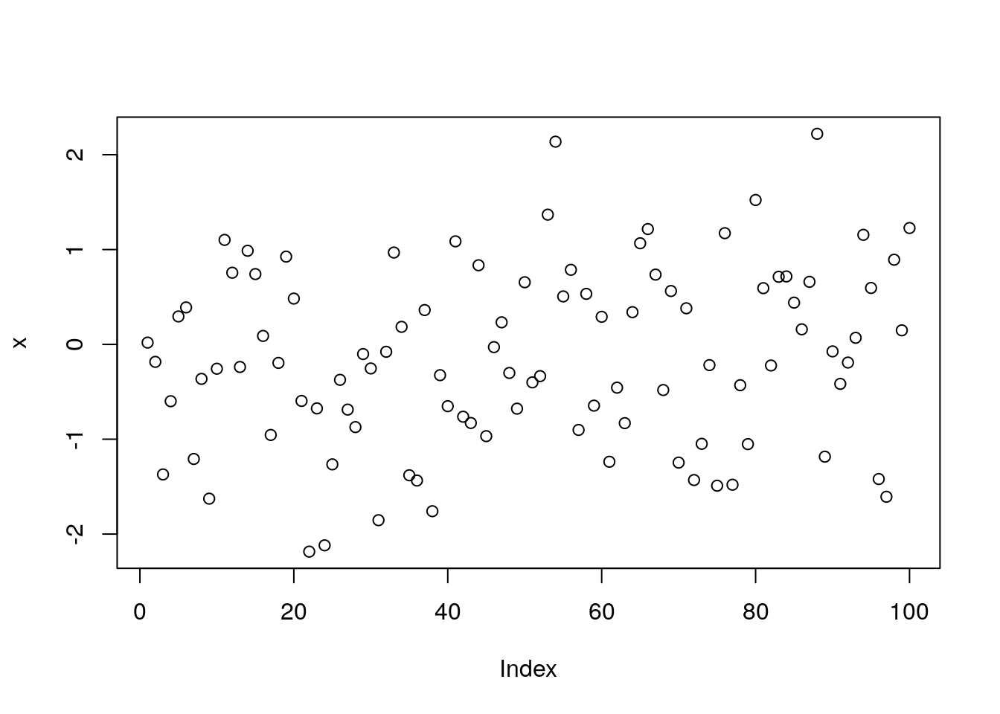
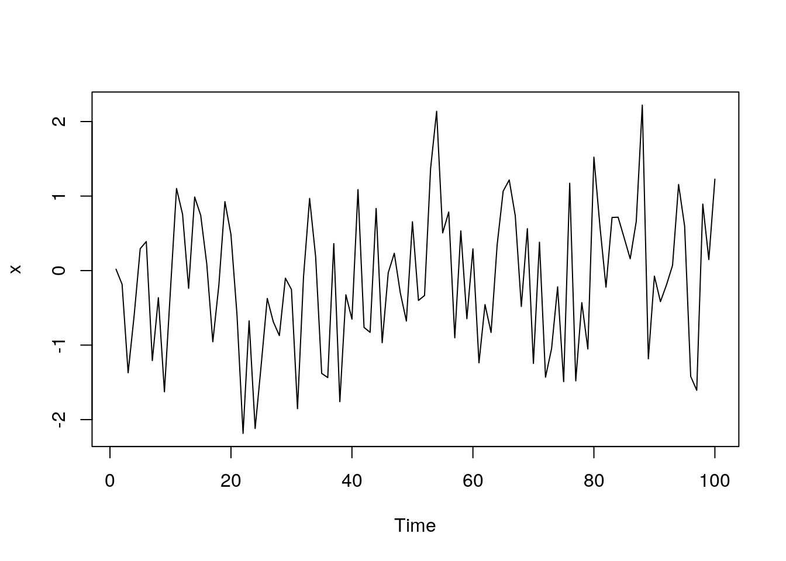

# Third week
In this module, we'll deal with the world of creating R packages and practice developing an R Markdown presentation that includes a data visualization built using Plotly.

## R Packages
An R Package is a form of data product. In creating an R package, you will create polished, documented software for your users. This is a big step over distributing functions or code that perform a task. In this brief set of lectures, we cover the basics of creating R packages.

### R Packages part 1
In this lecture we will be discussing how to build R packages, which is an essential tool for implementing your own statistical or other methodologies and distributing them to other R users through centralized platforms and repositories. We will cover the basic aspects and components involved in building an R package, so that you have a clear understanding of the process. R packages are a means of extending the basic functionality of R. While the base R distribution includes packages like graphics and GR devices, there are countless other types of functionality that are not included. The package system enables developers to write their own functions and other types of functionality that can be added on to the base installation. An R package typically consists of a collection of R functions and data objects, along with documentation and other elements that are organized in a systematic way. This allows users to access help files and other resources in a consistent manner. To find R packages you might visit a centralized repository like the Comprehensive R Archive Network or CRAN. Another major repository is called Bioconductor, which houses numerous tools for bioinformatics and genomics. Alternatively, many packages are hosted on source code sharing websites like GitHub, Bitbucket, and Gitorious. Installing packages from CRAN or Bioconductor is simple with the `install.packages()` function, where you specify the package name and repository. If you're installing packages from GitHub, you can use the `install_github()` function from the devtools package. Putting your package on a central repository to distribute makes it easy for people to find and install your package. 

What is the purpose of creating an R package and why is it advantageous over just sending a code file? There are several benefits to creating an R package. Firstly, it provides a structured format that other R users can understand, especially if they are already familiar with other R packages. Secondly, documentation is required for an R package, which forces the creator to write documentation that explains how the functions in the package should be used. This includes documenting the arguments and return values. Thirdly, creating an R package allows the creator to define a well-defined API, which specifies what functions the users should call and what functions they should not call. This allows the creator to hide the implementation details from the user and to change the details in the future without disrupting the public interface. Fourthly, maintaining an R package is typically easier because of the structure and documentation required. If the creator cannot or does not want to maintain the package anymore, they can pass it off to someone else, and the structure is already in place for the new maintainer. Finally, there are some standards for reliability and robustness associated with packages hosted on central repositories like CRAN, which can help users feel confident that the package will load properly and not cause problems on their system. 

The general process for developing an R package typically involves several steps. Initially, you write the R code in a script or .R file, testing and debugging it as necessary. Eventually, you may decide that the code is useful and should be made available to others. At this point, you'll incorporate the R code into the R package structure. The next step involves writing documentation for the user functions, which are the functions accessible to the public. Additionally, you may include other materials such as examples, demos, datasets, tutorials, or vignettes. Once everything is complete, the package can be compiled and packaged, and you'll have your R package ready for distribution. After creating an R package, you have the option to keep it for personal use, email it to a friend, or upload it to a repository such as CRAN or Bioconductor. You can also share the source code on sites like GitHub for others to view and modify. Once you make the package public, two scenarios may arise. First, users may encounter issues and notify you to fix them. Second, users may identify problems and offer solutions, which you can incorporate into your package. Having other users review to improve your code is beneficial. Once you incorporate these changes, you can release a new version of the package.


### R Packages part 2
An R package consists of several essential elements and optional elements. To create an R package, the first step is to create a directory on the file system. The directory is typically named after the package name, such as "my package". The next essential element is a description file, which contains metadata about the package include the name of the package, a title, a longer description, version number, and the name of the author. The version number typically follows a format of major number dot minor number dash patch level. The package also needs an R sub-directory containing R code and a man/sub-directory with documentation for the R code. The author may not necessarily be the person who created the package code, but it could be you. Additional optional elements include a NAMESPACE file, which is commonly used and highly recommended. For a full list of requirements, you can refer to the [Writing R Extensions](https://cran.r-project.org/doc/manuals/R-exts.html) document available on the R website. The maintainer plays a crucial role in the package's maintenance and must include their name and email address. They are responsible for addressing any issues that arise with the package. Another essential element is the license, which outlines the terms under which the source code is released. Common licenses for R code include the GNU public general license, BSD license, and MIT license. Other optional fields in the description file are "Depends," which lists the R packages that the package relies on, and "Suggests," which lists non-essential packages. The release date and URL for the package's home page can also be included. Additionally, you can add other fields for personal use, but they will be ignored by R. 

Here is an example of a description file from the gpclib package. 

```html
Package:  gpclib
Title:  General Polygon Clipping Library for R
Description:  General polygon clipping routines for R based on Alan Murta's C library.
Version:  1.6-1
Author:  Roger D. Peng <rpeng@jhsph.edu> with contributions from Duncan Murdoch and Barry Rowlingson; GPC library by Alan Murta
Maintainer:  Roger D. Peng <rpeng@jhsph.edu>
License:  MIT + file LICENSE
Depends:  R (>= 3.0.0), methods
Imports:  graphics
URL: https://github.com/rickbrew/GeneralPolygonClipper, https://github.com/rdpeng/gpclib
```

The package name is  gpclib, and the title is "General Polygon Clipping Library for R". The description field provides a brief explanation of what the package does, which is to provide general polygon clipping routines for R based on the C library by Alan Murta. The version number is 1.6-1. The author is the same as the maintainer and provides an email address for contact. The package has a special license, which is explained in the license files. It depends on R version 3.0.0 or later, as well as the methods package and the graphics package for importing functions. The URL for the website of the underlying C library and the GitHub repository is also provided. After writing the description file, the next step is to copy your R code into the R sub-directory. The number of files in this directory can vary and there is no need to have one file per function. However, it is recommended to organize the files into logical groups of functions, such as those for reading data or fitting models. All R code should be included in this directory and should not be included in any other part of the package.

The NAMESPACE file is important as it defines the API for your package and lists all the dependencies, including code from other packages. There are two types of things to indicate in this file: exports and imports. Exports are the functions that are available to the user and are considered public functions. Non-exported functions are not listed in this file and cannot be called directly by the user, unless they use some special functions to access the code. This allows you to hide implementation details from users and create a cleaner package interface. Imports allow your package to use functions from other packages without making those packages visible to the user. This is useful for avoiding loading unnecessary packages onto the search list and allows you to use the functionality of other packages without making them directly available to the user. Importing a function loads the package NAMESPACE but does not attach it to the search list. There are a few key directives for the NAMESPACE file, including export, which allows you to export a function, import, which is used for importing a package, and import from, which is used for importing a specific function from a package. These directives allow you to describe your package's dependencies and public API in a specific and clear way. Here is the NAMESPACE file for the gpclib package. 


```html
useDynLib(gpclib, .registration = TRUE, .fixes = "C_")

importFrom(graphics, plot)
import(methods)

exportClasses("gpc.poly", "gpc.poly.nohole")

exportMethods("show", "get.bbox", "plot", "intersect", "union",
              "setdiff", "[", "append.poly", "scale.poly", "area.poly",
              "get.pts", "coerce", "tristrip", "triangulate")

export("read.polyfile", "write.polyfile")
```

If you're using s4 classes and methods, the export classes and export methods directives are important. It's worth noting that while these directives look like R functions, they're not exactly the same. Here's an example of a NAMESPACE file from the mvtspolt package, which only has one function, mvtsplot. This function is the only one that users can call, and it imports the access function from the graphics package and all the functionality of the splines package. 


```html
# Generated by roxygen2: do not edit by hand

export(mvtsplot)
importFrom(RColorBrewer,brewer.pal)
importFrom(grDevices,colorRampPalette)
importFrom(grDevices,gray)
importFrom(graphics,Axis)
importFrom(graphics,abline)
importFrom(graphics,axis)
importFrom(graphics,box)
importFrom(graphics,image)
importFrom(graphics,layout)
importFrom(graphics,lines)
importFrom(graphics,par)
importFrom(graphics,plot)
importFrom(graphics,points)
importFrom(graphics,segments)
importFrom(graphics,strwidth)
importFrom(graphics,text)
importFrom(splines,ns)
importFrom(stats,complete.cases)
importFrom(stats,lm)
importFrom(stats,na.exclude)
importFrom(stats,predict)
importFrom(stats,quantile)
```

After creating the necessary files, documentation is crucial to help users understand how to use your function. Documentation files typically have a .Rd extension. The package documentation is important for users to understand how to use functions properly. Documentation files are written in a specific markup language and must be located in the "man" subdirectory of the package directory structure. A documentation file is required for every exported function, which means limiting the number of exported functions is advisable to reduce the workload of documentation.  Documentation can also cover data sets, basic concepts, or provide a package overview. 

For instance, the base R Line function has a simple help file that illustrates the components of a typical documentation file. 

```html
\name{line}
\alias{line}
\alias{residuals.tukeyline}
\title{Robust Line Fitting}
\description{
  Fit a line robustly as recommended in \emph{Exploratory Data Analysis}.
}
\usage{
line(x, y)
}
\arguments{
  \item{x, y}{the arguments can be any way of specifying x-y pairs. See
    \code{\link{xy.coords}}.}
}
\details{
  Cases with missing values are omitted.
  Long vectors are not supported.
}
\value{
  An object of class \code{"tukeyline"}.
  Methods are available for the generic functions \code{coef},
  \code{residuals}, \code{fitted}, and \code{print}.
}
\references{
  Tukey, J. W. (1977).
  \emph{Exploratory Data Analysis},
  Reading Massachusetts: Addison-Wesley.
}
```

The file contains a name and an alias to call up the documentation file. A title and description provide context for the function, followed by a usage section that shows how the function is called with its arguments. Arguments need to be described; for example, the Line function only has two arguments, x and y, which can be specified in various ways. After describing the arguments, the detailed section typically goes into more depth about various aspects of the function. In this example, there are only a few additional notes. Lastly, there is a value section which describes what is returned by the function. Some functions do not necessarily return anything useful, particularly plotting functions which often just have the side effect of creating a plot. In this case, the line function returns an object of class tukeyline. Finally, at the end of the help file, there may be references. For example, if you are implementing a statistical method and it has a reference such as a paper or book, you can include those references in the help file so that people know where to look if they want to explore the topic further.

Once you have your R code, R files, description, and NAMESPACE, you can begin building the package. There is a command line tool that comes with R called R CMD build which creates the package archive file with a .tar or .gz extension. Once you have built the package, you can run a series of tests on the package using the R CMD check command line program. This runs a set of tests to ensure that everything is consistent within the package structure, including documentation, exports, and imports. You can run R CMD build and R CMD check from the command line using a terminal or command shell type of application, or you can run them within R using the system function. 

```r
system("R CMD build newpackage") 
system("R CMD check newpackage")
```

As previously mentioned, **R Cmd check** performs various tests to ensure that your package is consistent and error-free. It checks for the existence of documentation, ensures that every exported function has documentation, and verifies that your code can be loaded. Additionally, it checks for common coding issues using a code checker in one of the tests. If your documentation contains examples, R Cmd check runs them to verify that they run properly. It also checks for mismatches between the argument list in your documentation and the code itself. Passing all of the tests in R Cmd check without errors or warnings is crucial if you intend to submit your package to CRAN.

To get started with creating an R package, you can use the `package.skeleton()` function. This function generates a directory structure, including the R directory, man directory, description file, and NAMESPACE file, based on the name of the function you pass as the first argument. It also creates documentation files in the man directory for any functions visible in your workspace. If you only want to include specific functions, ensure that they are the only functions in your workspace before running `package.skeleton()`. Once the package skeleton is created, you need to edit the documentation stubs in the man directory to customize them to your needs. Additionally, you must fill in all of the required information in the description file and namespace file.

In summary, R packages provide a standardized and systematic way to share R code with others. They are important for ensuring that packages have proper documentation and robustness. These packages can be obtained from repositories such as CRAN, Bioconductor, or GitHub. To create an R package, the basic checklist involves:
-   Creating a new directory
-   Adding R and man sub-directories (which can be done using `package.skeleton()`)
-   Writing a description file
-   Adding R code to the R sub-directory
-   Creating documentation files in the man sub-directory
-   Defining exports and imports in a NAMESPACE file
-   Building and checking the package to ensure it passes all tests. 
-   
This is the basic template for creating an R package.


### Building R Packages Demo
In this lecture, we will demonstrate how to build an R package using R Studio. We will build a small package with only two functions that will create a prediction model for a high-dimensional dataset using the top ten predictors. The package will be called the Top Ten package. Let's get started with building our R package in R Studio. The first thing we need to do is create a new project by clicking on "New Project" in the "Project" menu. We'll select "New Directory" and then choose "R Package" as the project type. We'll name our package "topten" and select our home directory as the subdirectory for the package files. After hitting "Create Project," we'll see that the package files have been created in the directory. The package files include a description file, a namespace file, and an R directory with a code file that's currently empty. We'll need to fill in the details for the description file, including the package title, version, date, author, maintainer, and description. Open the DESCRIPTION file and for title you can use "Building a Prediction Model from the Top 10 Features" with version 0.1.0. For author you should put your name, for maintainer you should put your name and more importantly provide your email address, for description you can put something like "Functions for building and prediction models from selecting the top 10 predictors in a dataset.", and for license you can use one of the open source licenses like "GPL-3". 

Now start a new R script named "topten.R" and write your function.

```r
# topten.R
topten <- function(x, y) {
  p <- ncol(x)
  if(p < 10)
    stop("there are less than 10 predictors")
  pvalues <- numeric(p)
  for(i in seq_len(p)) {
    fit <- lm(y ~ X[, i])
    summ <- summary(fit)
    pvalues [i] <- summ$coefficients [2, 4]
    ord <- order(pvalues)
    ord <- ord[1:10]
    x10 <- x[, ord] fit <- Im(y ~ ×10) coef (fit)
  }
  predict10 <- function(X,b){
    X<- cbind(1,X)
    drop(X%*%b)
  }
}
```

We begin by building a function called `topten(x,y)`, which takes two arguments: x and y. The x argument represents the matrix of predictors, while y represents the vector of responses. We check to see if there are at least ten predictors by verifying if the number of columns, p, is greater than or equal to ten. If p is less than ten, we stop.  Our prediction model works by fitting a univariate regression model for each predictor in the matrix of predictors, using the response vector y. We calculate the p-value associated with each predictor, sort them from smallest to largest, and choose the top ten predictors with the smallest p-values. We then use these predictors to build a final regression model. 

To achieve this, we start by initializing a vector of p-values, which we set to be an empty vector of zeros. We then loop through each predictor and fit a univariate regression model with `lm()`. We extract the p-values using `summary()` and store them in our `pvalues` vector. After fitting the univariate regression models for each predictor, we will accumulate all the p-values for each model, which can be obtained by extracting the fourth column from the summary of the model fit. Then, we will sort the p-values in ascending order to get the indices of the smallest to the largest p-values. From these indices, we will select the top ten predictors and create a new dataset called x10 with only those predictors. This dataset will be used to fit the final linear model, from which we will extract the coefficients using the `coefficients()` function. The top ten function returns these coefficients. To make predictions using the coefficients and new data, we have the function called `predict10`. This function takes a matrix of predictors, which can have no more than ten columns, and a vector of coefficients called `b`. It returns the predicted response for each row in the predictor matrix. First, we need to add the intercepts to the predictor matrix. Then, we perform a matrix multiplication of the updated predictor matrix and the coefficients from the final fitted model. We will call this matrix multiplication "x times b". Next, we need to drop the dimension of the resulting matrix to obtain a vector of predicted responses, which we will call `drop`. Our package consists of two functions, but to create a package, we also need to include documentation and specify the namespace file. We will use the **Roxygen2** package for documentation, which allows us to put the documentation in the code file itself. This has two advantages: it keeps us focused on one file and makes it easier to keep the documentation up to date since it is physically close to the code. 

Let's start documenting the top ten function using Roxygen2 package. First, we need to give it a title and a brief description of what it does. We'll call it "Build a Model with Top Ten Features", and the function develops a prediction algorithm based on the top ten features in x that are most predictive of y. Next, we'll document the function arguments. The first argument is x, which is an n by p matrix of n observations and p predictors. The second argument is y, which is a vector of length n representing the response. The function returns a vector of coefficients from the final fitted model with top ten features.


```r
#' Building a Model with Top Ten Features
#'
#' This function develops a prediction algorithm based on the top 10 features
#' in 'x' that are most predictive of 'y'
#'
#' @param × a n × p matrix of n observations and p predictors
#' @param y a vector of length n representing the response
#' @return a vector of coefficients from the final fitted model with top 10 features
#' @author Roger Peng
#' @details
#' This function runs a univariate regression of y on each predictor in × and
#'calculates a p-value indicating the significance of the association. The
# final set of 10 predictors is taken from the 10 smallest p-values.
#' @seealso \code{lm}
#' @export
#' @importFrom stats lm

topten <- function(x, y) {
  p <- ncol(x)
  if(p < 10)
    stop("there are less than 10 predictors")
  pvalues <- numeric(p)
  for(i in seq_len(p)) {
    fit <- lm(y ~ X[, i])
    summ <- summary(fit)
    pvalues [i] <- summ$coefficients [2, 4]
    }
    ord <- order(pvalues)
    ord <- ord[1:10]
    x10 <- x[, ord]
    fit <- lm(y ~ x10)
    coef (fit)
}

#' Prediction with Top Ten Features
#
#' This function takes a set of coefficients produced by the \code{topten}
#' function and makes a prediction for each of the values provided in the
#' input 'X' matrix.
#'
#' @param X a n × 10 matrix containing n new observations
#' @param b a vector of coefficients obtained from the \code{topten} function
#' @return a numeric vector containing the predicted values
#' @export!

  predict10 <- function(X,b){
    X<- cbind(1,X)
    drop(X%*%b)
  }
```

Note that both functions need to be exported, so we'll add an export directive for each. We also need to import the `lm()` function from the `stats` package in order to use it.

Now we can start building our package in R Studio. We'll go to the build tab and build the package, then load it into R. You'll notice that the documentation files haven't been created by Roxygen2, so we'll need to configure our build tools to generate them.
So, the next step is to generate the documentation using Roxygen and create the namespace file from the documentation we wrote. We can do this by configuring the build tools. The package documentation file on the left is not required, so we can delete it. After building and reloading the R package again, we can see that the two documentation files for our code have been written. The topten.Rd file contains all the information extracted from the documentation we wrote in the R file, and there's another set of documentation for the predict10.Rd.
Let's examine our **topten** package. We can load it using the library function and view its documentation using the help function with the package name as an argument. The description file we wrote is displayed, along with the exported functions. We can print out the code for the `topten()` function and view its documentation using the question mark followed by the function name. Similarly, we can view the documentation for the predict ten function. The R package is almost complete. We can check if it passes R command check by clicking the **check button** in the build tab. The tests run and if everything is okay, we will pass the test. We don't need to upload this package to command, but if we wanted to, passing R command check would be a good indication that it is ready for upload.

We have now created a basic R package by writing two functions, but as you can see, R Studio provides a lot of useful tools for package creation and documentation generation. We encourage you to give it a try and create your own package using the functions you have written in your previous assignments. With the help of R Studio's tools, the process can be completed quickly and easily.


### R Classes and Methods Part 1
The focus of this lecture is on the creation of classes and methods in R. The main objective of this process is to introduce new types of data or data structures that are not natively supported by R. For instance, while R has built-in functionalities for lists, it may not be equipped to handle new types of data that may emerge, such as data from a new field. In such cases, a new structure needs to be developed to manage this data, along with a new set of functions to operate on it. This is where classes and methods come in, enabling the R system to adapt and support various data types and structures. Therefore, this lecture will delve into the details of writing classes and methods to facilitate the process of supporting diverse data and data structures. The classes and methods system in R is essentially an object-oriented programming system. What's unique about R is that it was both an interactive system and supported a formal system for object orientation when it was first introduced. In contrast, other well-known object-oriented programming languages such as C++ and Java were not considered interactive languages. Instead, they were languages where you write programs, compile them, and then run them, rather than typing commands and executing them one at a time as in R. Much of the code for developing classes and methods in R was written by John Chambers, the creator of S and a prolific R programmer. The fundamental concepts are explained in his book [Programming with Data](https://link.springer.com/book/9780387985039). 

The concept behind the class and methods system in R is to facilitate the transition from being a user to becoming a programmer. As we discussed in the R programming class, John Chambers initially designed the S language with the idea that users would gradually become programmers as they became more familiar with the language and attempted to customize it. This philosophy is reflected in R, where users can initially execute functions, and as their needs expand beyond what R offers, they can become programmers and create new things in R using classes and methods. 

In R, there are two main styles of classes and methods, which are a result of its historical development. The older style is referred to as S3 classes and methods, which are informal, a bit clunky, and not very formally rigorous but they get the job done and work well. In fact, many basic functions in R are built on S3 classes and methods, making them quite useful and not going away anytime soon. The more formal and rigorous system for writing classes and methods is called the S4 system, which was introduced in R version 1.4.0 in December 2001. S4 classes and methods are sometimes called new-styled classes and methods and are encouraged for new projects where developers are creating new types of classes and methods. So, both the S3 and S4 systems will coexist in R for the foreseeable future due to the language's history and built-in functionality. However, they are separate systems, and it's not typical to mix them together when developing new projects. The S4 system is generally encouraged for new development, especially in projects like Bioconductor that use it extensively. While S3 classes and methods are sometimes useful for quick and dirty projects, we'll focus on S4 development in this discussion. The implementation of object-oriented methods in the S4 classes and methods is done through the methods package, which is usually loaded by default in R, if not, you can load it using the `library()` function and calling `library(<methods>)`. It's worth noting that we will touch on the S3 system to familiarize you with it, but we will mostly discuss developing in the S4 system. 

In object-oriented programming with R, we have classes and methods. A class is essentially a description of a new thing, such as a new data type or a new idea. You can define a class using the `setClass()` function in the methods package. Objects are instances of these classes and can be created using the `new()` function or other types of functions. A method is a function that operates on a specific class of objects. It's important to note that methods are functions that are specific to certain classes. Finally, there are generic functions, which are R functions that dispatch methods. Generic functions encapsulate a generic concept and can dispatch methods depending on the data type. For example, the `plot()` function is a generic function that can dispatch different plotting methods based on the data type. Generic functions don't perform any computation, but instead, their main job is to dispatch methods. A method is the implementation of a generic function for an object of a particular class. So, the main concepts in object-oriented programming in R are classes, objects, methods, and generic functions. As you progress in learning the system, you may find the help files in the methods package to be useful. The primary documentation is contained in the help files, which include `?Classes` and `?Methods` help pages. Additionally, you can refer to the help pages for `?setClass`, `?setMethod`, and ` `. Some of this material can be quite technical, so you may want to skim through it initially. However, as you become more familiar with the system, it will make more sense.

Every object in R has a class, which can be determined using the class function. For example, if we take the number 1, it has a class of "numeric" by default since numbers in R are typically represented as real or double-precision numbers. 

```r
class(1)
```

```
## [1] "numeric"
```

Logical values, "TRUE" and "FALSE", have their own class, "logical".


```r
class(TRUE)
```

```
## [1] "logical"
```

Randomly generated numbers would also have a class of "numeric", as they form a numeric vector. Missing values, represented by "NA", are by default logical, but you can also have missing values of other classes, such as missing integers. Character strings have a class of "character". These are all examples of atomic classes. 

```r
class(rnorm(10))
```

```
## [1] "numeric"
```

```r
class(NA)
```

```
## [1] "logical"
```

```r
class("oops")
```

```
## [1] "character"
```

In R, you can go beyond the atomic classes and create new data types. For instance, if you fit a linear model, the output from the `lm()` function is an lm class, which is not a standard data type like numeric, integer, or character. Instead, it represents a set of statistical ideas that are encapsulated in the output of a linear model. Thus, it deserves its own data type or class, which we call the lm data type. 


```r
x<-rnorm(100)
y<-x+rnorm(100)
fit<-lm(y~x) #linear regression model
class(fit)
```

```
## [1] "lm"
```

Generics and methods are functions that you write to implement functionality for certain types of classes. While S4 and S3 generic functions may look different, they play the same role conceptually. You can write new methods for an existing generic or create new generic functions for performing a new operation. To do this, you have to write both the generic and the method for a given data type. Help files in the methods package can provide documentation and guidance for learning and working with these concepts. In R, there are various generic functions such as `mean` and `print`. 


```r
mean
```

```
## function (x, ...) 
## UseMethod("mean")
## <bytecode: 0x5583355dc858>
## <environment: namespace:base>
```


```r
print
```

```
## function (x, ...) 
## UseMethod("print")
## <bytecode: 0x558334e17128>
## <environment: namespace:base>
```

These functions have almost no code associated with them except for a `UseMethod()` statement. The purpose of these generic functions is to find an appropriate method for a given data type. To see the available methods for a generic function, you can use the `methods()` function. 


```r
methods(mean)
```

```
## [1] mean.Date        mean.default     mean.difftime    mean.POSIXct    
## [5] mean.POSIXlt     mean.quosure*    mean.vctrs_vctr*
## see '?methods' for accessing help and source code
```

Some packages may add new methods to the generic functions as you load them into R. Here is an example of S4 generic function.


```r
show
```

```
## standardGeneric for "show" defined from package "methods"
## 
## function (object) 
## standardGeneric("show")
## <bytecode: 0x558338c90d98>
## <environment: 0x5583349a2220>
## Methods may be defined for arguments: object
## Use  showMethods("show")  for currently available ones.
## (This generic function excludes non-simple inheritance; see ?setIs)
```

 The `show()` function from the methods package is an S4 generic function that is equivalent to `print()`. When you print out the body of the `show()` function, you will see more code than for the S3 generic functions. 
 
 
 ```r
 showMethods(show)
 ```
 
 ```
 ## Function: show (package methods)
 ## object="ANY"
 ## object="classGeneratorFunction"
 ## object="classRepresentation"
 ## object="envRefClass"
 ## object="externalRefMethod"
 ## object="function"
 ##     (inherited from: object="ANY")
 ## object="genericFunction"
 ## object="genericFunctionWithTrace"
 ## object="MethodDefinition"
 ## object="MethodDefinitionWithTrace"
 ## object="MethodSelectionReport"
 ## object="MethodWithNext"
 ## object="MethodWithNextWithTrace"
 ## object="namedList"
 ## object="ObjectsWithPackage"
 ## object="oldClass"
 ## object="refClassRepresentation"
 ## object="refMethodDef"
 ## object="refObjectGenerator"
 ## object="signature"
 ## object="sourceEnvironment"
 ## object="standardGeneric"
 ##     (inherited from: object="genericFunction")
 ## object="traceable"
 ```
 
 The idea is the same, however, and the appropriate method is dispatched based on the class of the object being passed to it.  Most of the time in R, objects are auto-printed at the command line, so you don't usually need to call the `show()` or `print()` functions explicitly. However, various types of objects have their own special print or show methods that are associated with the `show()` or `print()` generic functions. 
 
 The interaction between generic functions and methods can be explained as follows. The first argument of any generic function is an object of a particular class. The generic function checks the class of the object and searches for a method specific to that class. If a method exists, it is called and the generic function's job is done. If there is no method for that class, the generic function checks for a default method that always gets applied if there is no specific method. If there is no default method, an error occurs. It is important to note that it is generally not possible to print the code of an S3 or S4 method function by simply typing the name of the function in the command line. Instead, you can use the `getS3method(<generic>, <class>)` or `getMethod(<generic>, <class>)` function to view the code. The first argument of these functions is the name of the generic, and the second argument is the class of the object.


### R Classes and Methods Part 2
In this example, we will demonstrate how a simple S3 class and method work. First, we generate a vector of random normal data and calculate its mean, which turns out to be -0.03069. 


```r
set.seed(2)
x <- rnorm(100) 
mean(x)
```

```
## [1] -0.03069816
```
However, there's a lot going on behind the scenes. The class of the vector x is numeric, so when we call the mean function on it, it will search for a specific method for numeric objects. However, since there is no such method, the default method for mean is called. This default method calculates the sum of all the elements in the vector and divides it by the length of the vector. You can inspect this default method using the `getS3method()` function, which reveals additional arguments like trim and na.rm. 


```r
head(getS3method("mean", "default"), 10)
```

```
##                                                                       
## 1  function (x, trim = 0, na.rm = FALSE, ...)                         
## 2  {                                                                  
## 3      if (!is.numeric(x) && !is.complex(x) && !is.logical(x)) {      
## 4          warning("argument is not numeric or logical: returning NA")
## 5          return(NA_real_)                                           
## 6      }                                                              
## 7      if (na.rm)                                                     
## 8          x <- x[!is.na(x)]                                          
## 9      if (!is.numeric(trim) || length(trim) != 1L)                   
## 10         stop("'trim' must be numeric of length one")
```
In the function's code, it checks a number of things, such as trimmed mean, before ultimately calling some internal C code that efficiently calculates the mean.

To illustrate a slightly more complex example, consider the following example. 


```r
set.seed(3)
df <- data.frame(x = rnorm(100), y = 1:100) 
sapply(df, mean)
```

```
##           x           y 
##  0.01103557 50.50000000
```

One important thing to note about data frames is that each column can potentially be of a different class. In this case, the first column is numeric, while the second column is integer. When we apply the mean function over the data frame using the `sapply()` function, the mean function will determine the class of each column and search for an appropriate method for that class. For the first column, which is numeric, there is no specific method, so the default method is called. For the second column, which is integer, there is also no specific method, so the default method is called again. If you have a large data frame with many columns of different classes, the mean function will check each column to find an appropriate method for that class. Sometimes it's possible to directly call an `S3method()`, as some methods are visible to the user. For instance, you can call the `mean.default` function directly without invoking the generic function. However, it's generally recommended to always call the generic function and let the appropriate method be dispatched automatically. This approach results in cleaner and more robust code, since the method name can change without affecting the underlying code. With the S4 system, this isn't an issue because for the most part, you cannot call methods directly. 

Here are two examples of an S3 Class/Method the `plot` function. 


```r
set.seed(10)
x <- rnorm(100) 
plot(x)
```



Here we generate random normal data and call the `plot()` function. Since there's no numeric method for `plot()`, it calls the default method and creates a scatter plot. 


```r
set.seed(10)
x <- rnorm(100)
x <- as.ts(x) ## Convert to a time series object 
plot(x)
```



However, in the second example, we convert the random data into a time series object using the `as.ts()` function and call `plot(x)` in the exact same way as before. This time, the plot looks different and has a label on the x-axis called **time**. This is because there's a special plotting method for time series objects, and that method is being called here instead of the default method. If you frequently work with new data types, such as gene expression or spatial-temporal data, it may be necessary to create a new class and write methods for printing, showing, summarizing, or plotting the data. 

There are two basic ways to extend R with the classes and methods system: you can create a new class and then write methods for existing generic functions like `print` or `plot`, or you can create new generic functions and methods for those generics for your new class. In this lecture, we will focus on S4 classes. The reason for creating a new class is that it allows you to work at a higher level of abstraction and represent more complex data types in a more compact manner. For instance, you might want to represent hierarchical or sparse matrices, which are not included in R's basic data types. New concepts often emerge, such as point process models or mixed effects models, that haven't been implemented in R yet, prompting the need for new classes. Additionally, you may want to hide implementation details from the user that would be exposed if you tried to represent a new data type using just lists and vectors. It's worth noting that creating a new class doesn't necessarily mean inventing a completely new data type; it simply means that R doesn't have any special handling for that type. To create a new class, you can use the `setClass()` function, which requires at least the name of the new class. However, new classes often have associated data elements called **slots**. You can define methods for the new class using the `setMethod()` function. Information about a class definition can be obtained with the `showClass()` function. At a high level, a class can be thought of as a list with slots, where each slot contains an object of a specific class. Thus, you cannot store arbitrary data in any slot; you must use the specific data type for that slot.

Here we are creating a polygon class there is no data object called polygon in R.


```r
library(methods) 
setClass("polygon",
        representation(x = "numeric",
        y = "numeric"))
```

To create a polygon class, one way is to represent it as a set of vertices with lines connecting them. This can be achieved by creating a class with two slots: x for the x coordinates of the vertices and y for the y coordinates of the vertices. It's important to note that the data type for each slot must be specified, such as **numeric** in this case. Once a new class is created, methods can be defined using the `setMethod()` function. For example, a plot method can be created for the Polygon class. The signature specifies the set of classes that the method will operate on, which in this case is the Polygon class. The plot method takes an X and a Y argument, where X is the polygon object and Y is missing. Other arguments can be passed in using the `@` symbol.


```r
setMethod("plot", "polygon", 
         function(x, y, ...) {
            plot(x@x, x@y, type = "n", ...) 
            xp <- c(x@x, x@x[1])
            yp <- c(x@y, x@y[1])
            lines(xp, yp)
            }
        )
```
Since plot already existed as a generic function, we did not need to create a new one. After calling setMethod the new plot method will be added to the list of methods for plot.


```r
library(methods) 
showMethods("plot")
```


```r
## Function: plot (package graphics)
## x="ANY"
## x="polygon"
```
In addition to "polygon" method, there is also a default method denoted by "ANY" for plot that takes an argument of any class. This method is called when no other method is available. 

Here we are creating a new object of the polygon class and plotting it.


```r
p <- new("polygon", x = c(1, 2, 3, 4), y = c(1, 2, 3, 1))
plot(p)
```

To demonstrate the process of creating a new class and its methods, we have used the `new()` function to create an object of the polygon class. This is an example of how classes and methods can be used to extend the functionality of R. Classes define new data types and allow R to represent new types of data, while methods specify the behavior of generic functions on these new classes. Developing classes and methods provides an easier interface for users to interact with new types of data without getting bogged down in implementation details. R packages are a popular way to make new classes and methods available to users. Keep in mind that the best way to learn this stuff is to look at examples. There are quite a few examples on CRAN which use S4 classes/methods. You can usually tell if they use S4 classes/methods if the methods package is listed in the `Depends: field`. Another good resource is the Bioconductor project, which is a collection of R packages for analyzing genomic data. The [Bioconductor](http://www.bioconductor.org) project makes extensive use of S4 classes and methods. The stats4 package (comes with R) has a bunch of classes/methods for doing maximum likelihood analysis.

## Quiz 3

## Assignment 3

